# DeepEP Layout 和 Buffer 深度剖析

本文档深入讲解 DeepEP 的 Layout 机制和 Buffer 构造，并通过 Mermaid 流程图可视化整个 Send/Recv 流程。

---

## 目录

1. [Layout 深度分析](#layout-深度分析)
2. [Buffer 内存布局](#buffer-内存布局)
3. [Send/Recv 流程图](#sendrecv-流程图)
4. [数据流可视化](#数据流可视化)

---

## Layout 深度分析

### Layout 的本质：分布式路由表

Layout 计算的核心任务是构建一张**分布式路由表**，回答以下问题：

1. **Token → Expert 映射**：每个专家需要处理哪些 tokens？
2. **Token → Rank 映射**：每个 rank 需要接收哪些 tokens？
3. **Expert → Rank 映射**（隐式）：专家如何分布在 ranks 上？

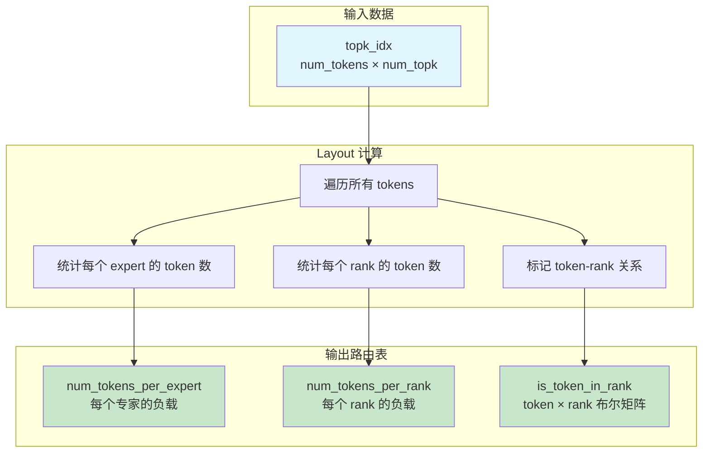

### Layout 的内存访问模式

Layout kernel 的性能关键在于**内存访问模式**的优化。

#### 读取模式：Coalesced Access

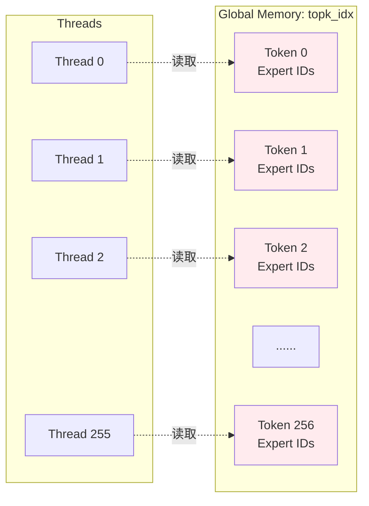

**Grid-Stride Loop 保证合并访问**：
- 线程 0 访问 tokens: 0, 256, 512, ...
- 线程 1 访问 tokens: 1, 257, 513, ...
- 所有线程在同一时刻访问连续的内存地址 → **Coalesced**

#### 写入模式：Shared Memory → Reduction → Global Memory

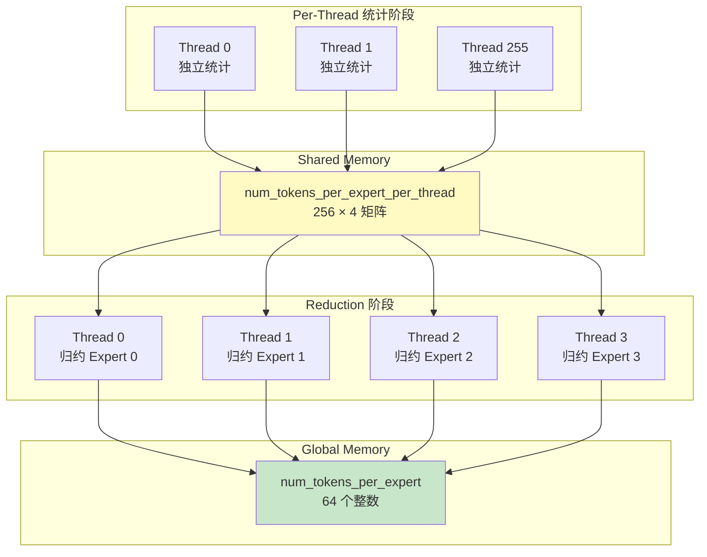

**优势**：
- Per-thread 写入：**无竞争**，无原子操作
- Shared memory：**低延迟**（~20 cycles vs ~400 cycles）
- Reduction：**并行归约**，仅 4 个线程参与（专家数量）

---

### Layout 的负载均衡策略

#### SM 级别的任务分配

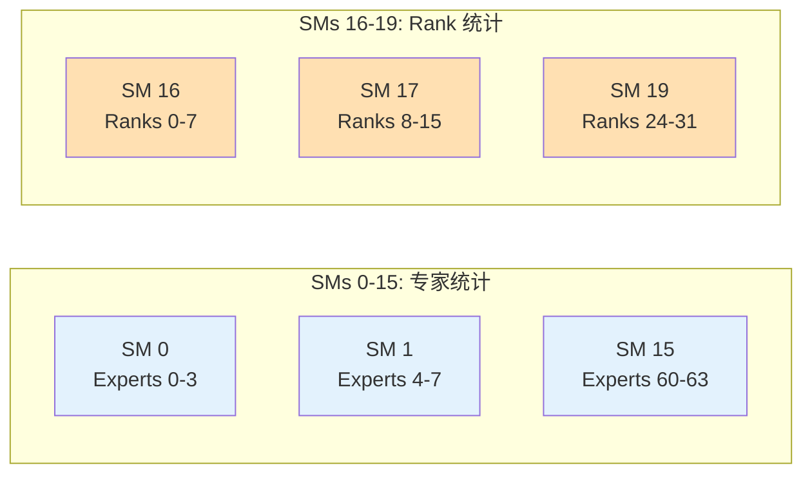

**配置**：
- `kNumExpertsPerSM = 4`：每个 SM 统计 4 个专家
- `kNumRanksPerSM = 8`：每个 SM 统计 8 个 ranks
- 64 专家 → 16 SMs，32 ranks → 4 SMs

#### 线程级别的负载均衡

```
Grid-Stride Loop:
  for (int i = thread_id; i < num_tokens; i += kNumThreads)

示例（num_tokens = 4096, kNumThreads = 256）：
  Thread 0: 处理 tokens [0, 256, 512, ..., 3840]  → 16 个
  Thread 1: 处理 tokens [1, 257, 513, ..., 3841]  → 16 个
  ...
  Thread 255: 处理 tokens [255, 511, 767, ..., 4095] → 16 个

每个线程负载：4096 / 256 = 16 个 tokens
```

---

### Layout 的数学本质

#### 专家索引 → Rank 索引转换

假设专家均匀分布：

```
给定：
  - num_experts = 64
  - num_ranks = 32
  - num_expert_per_rank = 64 / 32 = 2

映射关系：
  Expert 0, 1   → Rank 0
  Expert 2, 3   → Rank 1
  Expert 4, 5   → Rank 2
  ...
  Expert 62, 63 → Rank 31

计算公式：
  rank_id = expert_id / num_expert_per_rank
  rank_id = expert_id / 2
```

**代码实现** (layout.cu:85)：
```cpp
rank_idx = expert_idx / num_expert_per_rank - rank_begin_idx;
```

#### Token 是否发送到 Rank 的判断

```
给定 token i，top-k 专家为 [e0, e1, ..., e_{k-1}]

判断是否发送到 rank r：
  - 计算 rank r 负责的专家范围 [expert_begin, expert_end)
  - 遍历 token i 的 top-k 专家
  - 如果至少有一个专家在 [expert_begin, expert_end) 范围内
    → is_token_in_rank[i][r] = true

示例：
  Token 0, top-4 = [2, 15, 30, 45]
  Rank 0 负责 experts [0, 2)
  → Expert 2 不在范围内（2 >= 2）
  → is_token_in_rank[0][0] = false

  Rank 1 负责 experts [2, 4)
  → Expert 2 在范围内
  → is_token_in_rank[0][1] = true
```

**代码实现** (layout.cu:92-94)：
```cpp
for (int j = 0; j + rank_begin_idx < rank_end_idx; ++j) {
    shifted_is_token_in_rank[j + rank_begin_idx] = (is_in_rank[j] > 0);
    num_tokens_per_rank_per_thread[thread_id][j] += (is_in_rank[j] > 0);
}
```

---

## Buffer 内存布局

### Buffer 的层次结构

DeepEP 使用**分层 Buffer 管理**，在接收端的共享内存中构建复杂的通信队列。

```mermaid
graph TB
    subgraph "每个 Rank 的 Buffer"
        A[Rank Prefix Matrix<br/>kNumRanks × kNumRanks × sizeof int]

        subgraph "Channel 元数据区"
            B1[start_offset<br/>num_channels × kNumRanks × sizeof int]
            B2[end_offset<br/>num_channels × kNumRanks × sizeof int]
            B3[head_idx<br/>num_channels × kNumRanks × sizeof int]
            B4[tail_idx<br/>num_channels × kNumRanks × sizeof int]
        end

        subgraph "Channel 数据区"
            C1[x_buffers<br/>循环缓冲区<br/>num_channels × kNumRanks × num_recv_buffer_tokens × hidden_int4 × sizeof int4]
            C2[src_idx_buffers<br/>num_channels × kNumRanks × num_recv_buffer_tokens × sizeof int]
            C3[topk_idx_buffers<br/>num_channels × kNumRanks × num_recv_buffer_tokens × num_topk × sizeof topk_idx_t]
            C4[topk_weights_buffers<br/>num_channels × kNumRanks × num_recv_buffer_tokens × num_topk × sizeof float]
            C5[x_scales_buffers<br/>num_channels × kNumRanks × num_recv_buffer_tokens × num_scales × sizeof float]
        end
    end

    A --> B1
    B1 --> B2
    B2 --> B3
    B3 --> B4
    B4 --> C1
    C1 --> C2
    C2 --> C3
    C3 --> C4
    C4 --> C5

    style A fill:#ffcdd2
    style B1 fill:#fff9c4
    style B2 fill:#fff9c4
    style B3 fill:#fff9c4
    style B4 fill:#fff9c4
    style C1 fill:#c8e6c9
    style C2 fill:#c8e6c9
    style C3 fill:#c8e6c9
    style C4 fill:#c8e6c9
    style C5 fill:#c8e6c9
```

### Buffer 内存布局详解

#### 1. Rank Prefix Matrix（行前缀和矩阵）

```
存储格式：[kNumRanks × kNumRanks] 矩阵

rank_prefix_matrix[i][j] 表示：
  - 前 i+1 个 ranks 发送到 rank j 的 token 累计数量

示例（4 ranks）：
  每个 rank 发送的 token 数：
    Rank 0 → [10, 20, 15, 25]  (发送到 ranks 0,1,2,3)
    Rank 1 → [12, 18, 22, 28]
    Rank 2 → [8,  15, 20, 17]
    Rank 3 → [14, 21, 19, 26]

  rank_prefix_matrix (前缀和)：
    [10,  20,  15,  25]   ← Rank 0 的贡献
    [22,  38,  37,  53]   ← Rank 0+1 的累计
    [30,  53,  57,  70]   ← Rank 0+1+2 的累计
    [44,  74,  76,  96]   ← 所有 ranks 的累计

用途：
  - 接收端确定数据在最终 buffer 的位置
  - rank_offset = rank_prefix_matrix[src_rank - 1][dst_rank]
```

#### 2. Channel 元数据（通信协调）

每个 channel-rank 对有 4 个元数据：

```
channel_start_offset[channel][rank]:
  - 该 channel 发送的起始 token 在前缀和中的偏移
  - 发送端写入，接收端读取
  - 使用负数编码：0 → -1, 1 → -2（区分 0 和未初始化）

channel_end_offset[channel][rank]:
  - 该 channel 发送的结束 token 在前缀和中的偏移
  - 发送端写入，接收端读取

channel_head_idx[channel][rank]:
  - 接收端已消费的循环缓冲区位置
  - 接收端写入，发送端读取（用于流控）

channel_tail_idx[channel][rank]:
  - 发送端已写入的循环缓冲区位置
  - 发送端写入，接收端读取
```

**循环缓冲区的指针语义**：

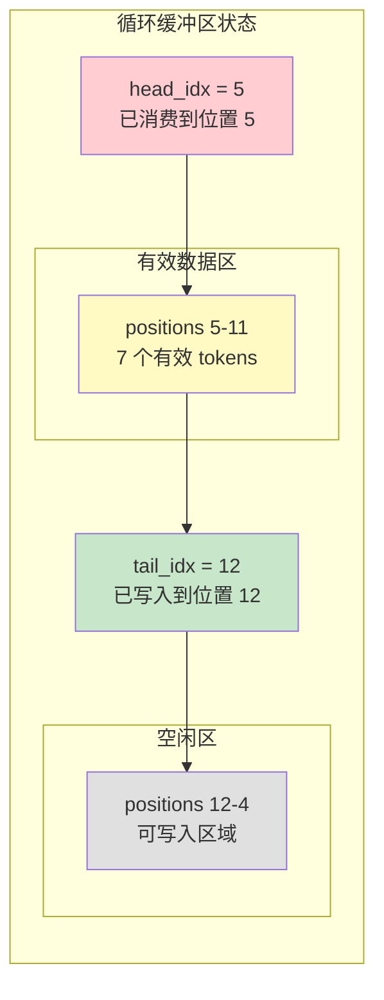

#### 3. Buffer 模板类（设备端辅助）

**Buffer<dtype_t>** (buffer.cuh:8-32)：

```cpp
template <typename dtype_t>
struct Buffer {
private:
    uint8_t* ptr;           // 缓冲区指针
    int64_t total_bytes;    // 总字节数

public:
    // 构造函数：从全局指针切分一块内存
    __device__ Buffer(void*& gbl_ptr, int num_elems, int offset = 0) {
        total_bytes = num_elems * sizeof(dtype_t);
        ptr = static_cast<uint8_t*>(gbl_ptr) + offset * sizeof(dtype_t);
        gbl_ptr = static_cast<uint8_t*>(gbl_ptr) + total_bytes;  // 推进全局指针
    }

    // 获取类型化指针
    __device__ dtype_t* buffer() {
        return reinterpret_cast<dtype_t*>(ptr);
    }

    // 下标访问
    __device__ dtype_t& operator[](int idx) {
        return buffer()[idx];
    }
};
```

**使用方式**（链式分配）：

```cpp
// 起始：ptr 指向大块内存的起始位置
auto ptr = reinterpret_cast<void*>(buffer_ptrs[rank] + rank_prefix_bytes);

// 分配 channel_start_offset
auto channel_start_offset = Buffer<int>(ptr, num_channels_total, channel_rank_offset);
// ptr 自动推进 num_channels_total * sizeof(int) 字节

// 分配 channel_end_offset
auto channel_end_offset = Buffer<int>(ptr, num_channels_total, channel_rank_offset);
// ptr 继续推进

// 分配 channel_head_idx
auto channel_head_idx = Buffer<int>(ptr, num_channels_total, channel_rank_offset);

// ... 以此类推
```

**优势**：
- **自动内存管理**：链式分配，自动推进指针
- **类型安全**：模板化，避免类型错误
- **偏移支持**：`offset` 参数支持跳过前面的元素

---

### Channel 数据缓冲区的循环队列实现

#### 循环队列的数学模型

```
容量：num_recv_buffer_tokens（例如 256）
Head：已消费位置
Tail：已写入位置

队列状态：
  - 空队列：head == tail
  - 满队列：(tail - head) == capacity
  - 有效元素数：tail - head
  - 写入位置：slot = tail % capacity
  - 读取位置：slot = head % capacity

示例：
  capacity = 8, head = 5, tail = 12

  有效数据：12 - 5 = 7 个元素
  物理位置：
    slot 5, 6, 7, 0, 1, 2, 3（循环）

  下一个写入位置：12 % 8 = 4
  下一个读取位置：5 % 8 = 5
```

#### 流控机制（Back-Pressure）

发送端在写入前检查队列是否有足够空间：

```cpp
// 发送端检查 (intranode.cu:327-329)
int num_used_slots = cached_channel_tail_idx - ld_volatile_global(channel_head_idx.buffer());
if (num_recv_buffer_tokens - num_used_slots >= num_max_send_tokens)
    break;  // 有足够空间，继续发送
```

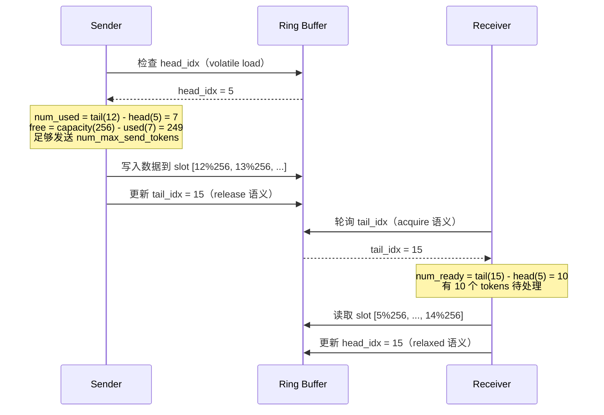

**内存序语义的选择**：

| 操作 | 内存序 | 原因 |
|------|--------|------|
| Sender 写 `tail_idx` | `st_release_sys_global` | 保证之前的数据写入对接收端可见 |
| Receiver 读 `tail_idx` | `ld_acquire_sys_global` | 保证读取到最新值，并建立 happens-before 关系 |
| Sender 读 `head_idx` | `ld_volatile_global` | 获取最新消费位置，无需 acquire（仅用于流控） |
| Receiver 写 `head_idx` | `st_relaxed_sys_global` | 发送端只需知道大致进度，无需强同步 |

---

### 完整的 Buffer 内存布局示例

```
假设配置：
  - num_ranks = 8
  - num_channels = 12（num_sms / 2 = 24 / 2）
  - num_recv_buffer_tokens = 256
  - hidden_int4 = 1792（7168 / 4）
  - num_topk = 8
  - num_scales = 56（7168 / 128）

每个 Rank 的 Buffer 总大小：

1. Rank Prefix Matrix:
   8 × 8 × 4 bytes = 256 bytes

2. Channel 元数据：
   4 个数组 × (12 × 8) × 4 bytes = 1536 bytes

3. x_buffers（主要开销）：
   12 × 8 × 256 × 1792 × 16 bytes = 8.8 GB

4. src_idx_buffers:
   12 × 8 × 256 × 4 bytes = 98 KB

5. topk_idx_buffers:
   12 × 8 × 256 × 8 × 8 bytes = 1.6 MB

6. topk_weights_buffers:
   12 × 8 × 256 × 8 × 4 bytes = 786 KB

7. x_scales_buffers:
   12 × 8 × 256 × 56 × 4 bytes = 5.5 MB

总计：约 8.8 GB / Rank（主要是 x_buffers）
```

---

## Send/Recv 流程图

### 整体流程概览

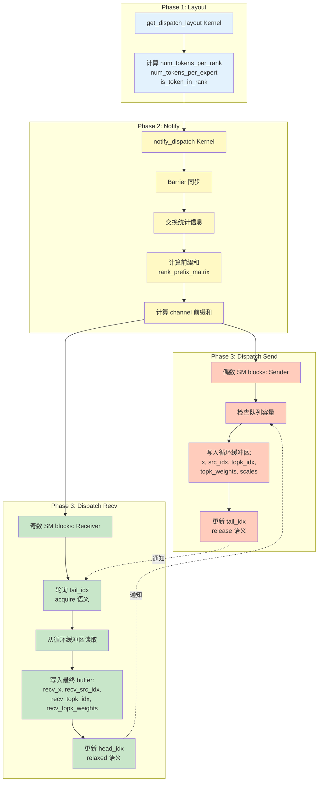

---

### Notify Dispatch 详细流程

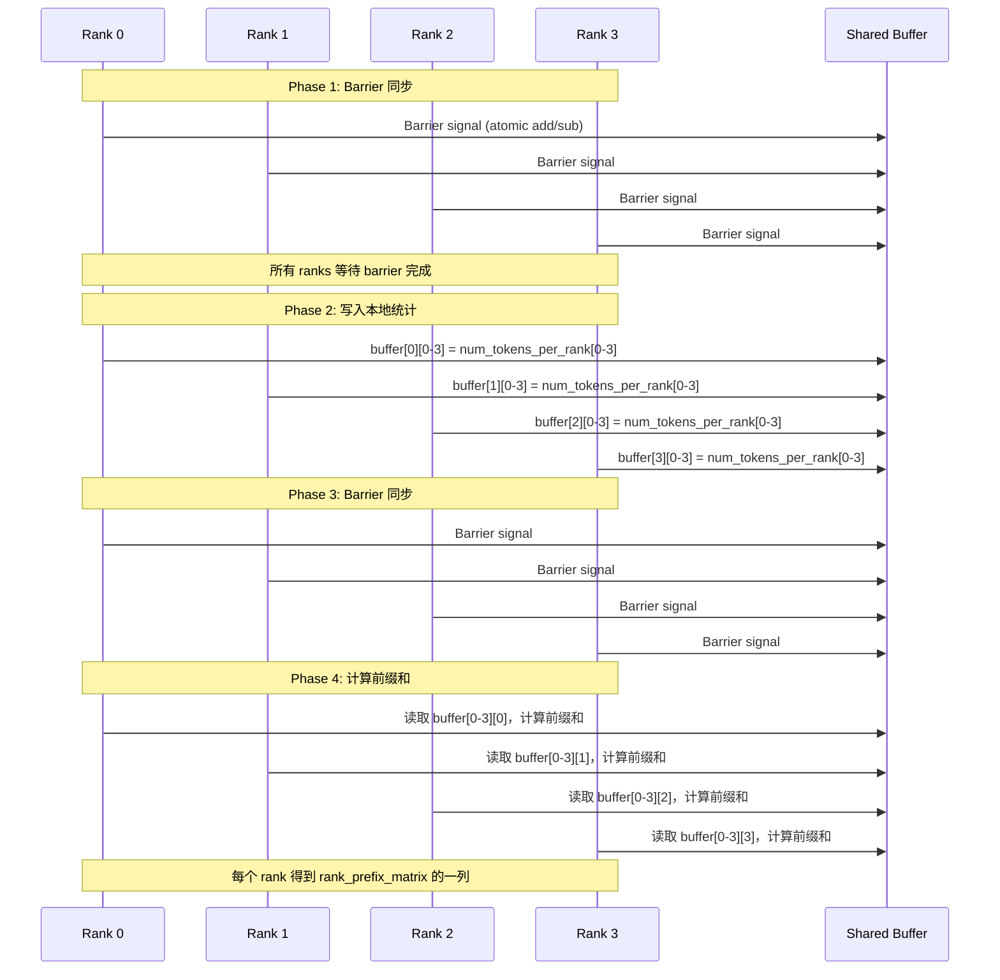

**前缀和计算示例**：

```
输入（每个 rank 发送的 token 数）：
  buffer[0][1] = 20  (Rank 0 发送到 Rank 1)
  buffer[1][1] = 18  (Rank 1 发送到 Rank 1)
  buffer[2][1] = 15  (Rank 2 发送到 Rank 1)
  buffer[3][1] = 21  (Rank 3 发送到 Rank 1)

Rank 1 的线程计算前缀和：
  rank_prefix_matrix[0][1] = 20
  rank_prefix_matrix[1][1] = 20 + 18 = 38
  rank_prefix_matrix[2][1] = 38 + 15 = 53
  rank_prefix_matrix[3][1] = 53 + 21 = 74

用途：
  - Rank 0 发送的数据位置：[0, 20)
  - Rank 1 发送的数据位置：[20, 38)
  - Rank 2 发送的数据位置：[38, 53)
  - Rank 3 发送的数据位置：[53, 74)
```

---

### Dispatch Send 详细流程

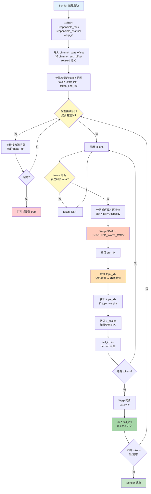

**关键代码位置**：

1. **队列容量检查** (intranode.cu:324-337)：
   ```cpp
   if (elect_one_sync()) {
       while (true) {
           int num_used_slots = cached_channel_tail_idx -
               ld_volatile_global(channel_head_idx.buffer());
           if (num_recv_buffer_tokens - num_used_slots >= num_max_send_tokens)
               break;
       }
   }
   ```

2. **数据拷贝** (intranode.cu:358-360)：
   ```cpp
   auto shifted_channel_x_buffers = channel_x_buffers.buffer() + dst_slot_idx * hidden_int4;
   auto shifted_x = x + token_idx * hidden_int4;
   UNROLLED_WARP_COPY(5, lane_id, hidden_int4,
       shifted_channel_x_buffers, shifted_x, __ldg, st_na_global);
   ```

3. **Top-K 索引转换** (intranode.cu:369-373)：
   ```cpp
   int recv_expert_begin = responsible_rank * num_experts_per_rank;
   int recv_expert_end = (responsible_rank + 1) * num_experts_per_rank;
   auto idx_value = __ldg(topk_idx + token_idx * num_topk + lane_id);
   idx_value = (idx_value >= recv_expert_begin and idx_value < recv_expert_end)
       ? idx_value - recv_expert_begin : -1;
   ```

4. **尾指针更新** (intranode.cu:396-397)：
   ```cpp
   if (send_warp_id_in_rank == 0 and elect_one_sync())
       st_release_sys_global(channel_tail_idx.buffer(), cached_channel_tail_idx);
   ```

---

### Dispatch Recv 详细流程

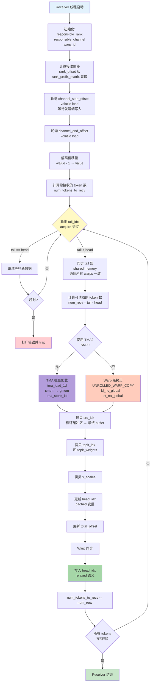

**关键代码位置**：

1. **等待元数据** (intranode.cu:415-420)：
   ```cpp
   if (elect_one_sync()) {
       while ((total_offset = ld_volatile_global(channel_start_offset.buffer())) == 0);
       while ((num_tokens_to_recv = ld_volatile_global(channel_end_offset.buffer())) == 0);
       total_offset = -total_offset - 1;
       num_tokens_to_recv = -num_tokens_to_recv - 1;
   }
   ```

2. **轮询 tail** (intranode.cu:436-443)：
   ```cpp
   while (recv_thread_id_in_rank == 0) {
       cached_channel_tail_idx = ld_acquire_sys_global(channel_tail_idx.buffer());

       if (cached_channel_head_idx != cached_channel_tail_idx) {
           shared_channel_tail_idx[responsible_rank] = cached_channel_tail_idx;
           break;
       }
   }
   ```

3. **TMA 拷贝（SM90）** (intranode.cu:468-475)：
   ```cpp
   for (int i = 0; i < 2; ++i) {
       tma_store_wait<0>();
       if (elect_one_sync()) {
           tma_load_1d(tma_buffer, shifted_buffer_x_int4 + i * half_hidden_int4,
               tma_mbarrier, half_hidden_bytes);
           mbarrier_arrive_and_expect_tx(tma_mbarrier, half_hidden_bytes);
           mbarrier_wait(tma_mbarrier, tma_phase);
           tma_store_1d(tma_buffer, shifted_recv_x_int4 + i * half_hidden_int4,
               half_hidden_bytes, false);
       }
   }
   ```

4. **头指针更新** (intranode.cu:513-514)：
   ```cpp
   if (recv_warp_id_in_rank == num_recv_warps_per_rank - 1 and elect_one_sync())
       st_relaxed_sys_global(channel_head_idx.buffer(), cached_channel_head_idx);
   ```

---

## 数据流可视化

### 单个 Token 的完整旅程

```mermaid
graph TB
    subgraph "Rank 0: Token 生成"
        T[Token 42<br/>topk_idx = [2, 15, 30, 45]<br/>x = [hidden vector]]
    end

    subgraph "Layout 阶段"
        L1[检查 Expert 2 → Rank 1]
        L2[检查 Expert 15 → Rank 7]
        L3[检查 Expert 30 → Rank 15]
        L4[检查 Expert 45 → Rank 22]

        L5[is_token_in_rank[42][1] = true<br/>is_token_in_rank[42][7] = true<br/>is_token_in_rank[42][15] = true<br/>is_token_in_rank[42][22] = true]
    end

    subgraph "Dispatch: Rank 0 → Rank 1"
        S1[Sender: Channel 3]
        S2[检查 is_token_in_rank[42][1] = true]
        S3[分配 slot = 127]
        S4[拷贝 x 到 channel_x_buffers[127]]
        S5[拷贝 src_idx = 42]
        S6[转换 topk_idx:<br/>[2,15,30,45] → [2,-1,-1,-1]<br/>只保留 Rank 1 的专家]
        S7[更新 tail_idx]
    end

    subgraph "Dispatch: Rank 1 接收"
        R1[Receiver: Channel 3]
        R2[轮询 tail_idx]
        R3[发现新数据]
        R4[读取 channel_x_buffers[127]]
        R5[写入 recv_x[offset + chunk_idx]]
        R6[读取 src_idx = 42]
        R7[读取 topk_idx = [2,-1,-1,-1]]
        R8[更新 head_idx]
    end

    subgraph "Rank 1: Expert 处理"
        E[Expert 2 处理 token 42<br/>计算输出]
    end

    T --> L1
    T --> L2
    T --> L3
    T --> L4
    L1 --> L5
    L2 --> L5
    L3 --> L5
    L4 --> L5

    L5 --> S1
    S1 --> S2
    S2 --> S3
    S3 --> S4
    S4 --> S5
    S5 --> S6
    S6 --> S7

    S7 -.通知.-> R1
    R1 --> R2
    R2 --> R3
    R3 --> R4
    R4 --> R5
    R5 --> R6
    R6 --> R7
    R7 --> R8

    R8 --> E

    style T fill:#e3f2fd
    style L5 fill:#fff9c4
    style S7 fill:#ffccbc
    style R8 fill:#c8e6c9
    style E fill:#b39ddb
```

---

### 多 Channel 并行传输

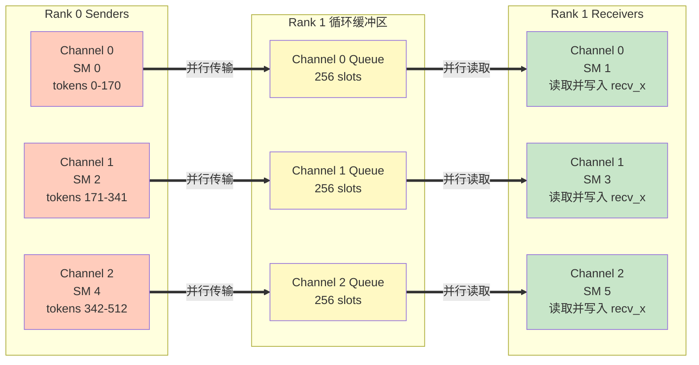

**并行度分析**：

```
假设配置：
  - num_sms = 24
  - num_channels = 12
  - num_ranks = 8

每个 rank 有 12 个独立的通信通道
每个通道由一对 SM 负责（sender + receiver）

总并行度：
  - 12 channels × 8 ranks = 96 个独立的通信流
  - 每个流使用独立的循环缓冲区
  - 无需全局同步（除了 notify 阶段）

带宽利用率：
  - NVLink 带宽：~900 GB/s（H800，双向）
  - 实测：~153 GB/s dispatch, ~158 GB/s combine
  - 利用率：~17%（受限于 PCIe 拓扑和 CUDA kernel 开销）
```

---

### Top-K 索引转换可视化

```mermaid
graph TB
    subgraph "全局专家索引（Rank 0 视角）"
        G[Token topk_idx = [2, 15, 30, 45]]
    end

    subgraph "专家分布"
        D["Rank 0: Experts [0, 2)<br/>Rank 1: Experts [2, 4)<br/>...<br/>Rank 7: Experts [14, 16)<br/>...<br/>Rank 15: Experts [30, 32)<br/>...<br/>Rank 22: Experts [44, 46)"]
    end

    subgraph "发送到 Rank 1（Experts [2, 4)）"
        T1["转换逻辑:<br/>Expert 2: 在范围内 → 2 - 2 = 0<br/>Expert 15: 不在范围内 → -1<br/>Expert 30: 不在范围内 → -1<br/>Expert 45: 不在范围内 → -1"]

        R1[Rank 1 接收:<br/>topk_idx = [0, -1, -1, -1]<br/>topk_weights = [w0, 0, 0, 0]]
    end

    subgraph "发送到 Rank 7（Experts [14, 16)）"
        T7["转换逻辑:<br/>Expert 2: 不在范围内 → -1<br/>Expert 15: 在范围内 → 15 - 14 = 1<br/>Expert 30: 不在范围内 → -1<br/>Expert 45: 不在范围内 → -1"]

        R7[Rank 7 接收:<br/>topk_idx = [-1, 1, -1, -1]<br/>topk_weights = [0, w1, 0, 0]]
    end

    G --> D
    D --> T1
    D --> T7
    T1 --> R1
    T7 --> R7

    style G fill:#e3f2fd
    style D fill:#fff9c4
    style T1 fill:#ffccbc
    style T7 fill:#ffccbc
    style R1 fill:#c8e6c9
    style R7 fill:#c8e6c9
```

**转换代码** (intranode.cu:369-373)：

```cpp
int recv_expert_begin = responsible_rank * num_experts_per_rank;  // 例如 Rank 1: 2
int recv_expert_end = (responsible_rank + 1) * num_experts_per_rank;  // Rank 1: 4

auto idx_value = __ldg(topk_idx + token_idx * num_topk + lane_id);  // 读取全局索引
idx_value = (idx_value >= recv_expert_begin and idx_value < recv_expert_end)
    ? idx_value - recv_expert_begin  // 在范围内：转为本地索引
    : -1;                             // 不在范围内：标记为 -1

channel_topk_idx_buffers[dst_slot_idx * num_topk + lane_id] = idx_value;
```

---

## 总结与关键洞察

### Layout 的设计精髓

1. **分治思想**：专家统计和 rank 统计分开，由不同 SMs 处理
2. **Per-thread + Reduction**：避免原子操作，最大化并行度
3. **Grid-Stride Loop**：完美负载均衡，支持任意规模
4. **内存访问优化**：Coalesced reads, Shared memory writes

### Buffer 的架构亮点

1. **分层管理**：元数据区 + 数据区分离
2. **循环队列**：流水线传输，避免固定大小限制
3. **模板化设计**：类型安全，自动内存管理
4. **内存序精细控制**：Release/Acquire 语义保证正确性

### Send/Recv 的核心机制

1. **生产者-消费者模式**：异步发送/接收，双缓冲流水线
2. **流控（Back-Pressure）**：发送端检查队列容量，避免溢出
3. **多通道并行**：12 个独立通道，最大化带宽利用
4. **Top-K 索引转换**：全局索引 → 本地索引，减少通信开销

### 性能优化的关键

1. **无全局同步**：除 notify 阶段外，send/recv 完全异步
2. **Warp 级并行**：UNROLLED_WARP_COPY 充分利用 warp 带宽
3. **TMA 加速（SM90）**：硬件加速内存拷贝，降低延迟
4. **内存访问模式**：ld_nc_global, st_na_global 避免缓存污染

### 可扩展性分析

```
配置灵活性：
  - num_channels 可调：控制并行度 vs 开销
  - num_recv_buffer_tokens 可调：控制队列深度
  - num_sms 可调：适配不同 GPU 架构

扩展限制：
  - NVLink 带宽：物理瓶颈
  - Shared memory：限制 buffer 大小
  - SM 数量：限制最大并行度
```

---

## 附录：关键数据结构总结

### Layout 输出

| 名称 | 类型 | 维度 | 用途 |
|------|------|------|------|
| `num_tokens_per_expert` | `int*` | `[num_experts]` | 每个专家的 token 数量 |
| `num_tokens_per_rank` | `int*` | `[num_ranks]` | 每个 rank 的 token 数量 |
| `is_token_in_rank` | `bool*` | `[num_tokens, num_ranks]` | token-rank 路由矩阵 |
| `num_tokens_per_rdma_rank` | `int*` | `[num_rdma_ranks]` | 每个 RDMA rank 的 token 数量（节点间） |

### Buffer 结构

| 区域 | 大小（以 4 KB 为单位） | 用途 |
|------|----------------------|------|
| Rank Prefix Matrix | `num_ranks² × 4 bytes` | 前缀和矩阵 |
| Channel Metadata | `4 × num_channels × num_ranks × 4 bytes` | 队列元数据（offset, head, tail） |
| x_buffers | `num_channels × num_ranks × num_recv_buffer_tokens × hidden × sizeof(dtype)` | 主数据缓冲区（约 8.8 GB） |
| src_idx_buffers | `num_channels × num_ranks × num_recv_buffer_tokens × 4 bytes` | 源索引 |
| topk_idx_buffers | `num_channels × num_ranks × num_recv_buffer_tokens × num_topk × 8 bytes` | Top-K 索引 |
| topk_weights_buffers | `num_channels × num_ranks × num_recv_buffer_tokens × num_topk × 4 bytes` | Top-K 权重 |
| x_scales_buffers | `num_channels × num_ranks × num_recv_buffer_tokens × num_scales × 4 bytes` | FP8 量化参数 |

---

**完整流程回顾**：

```
Layout → Notify → Dispatch (Send || Recv) → Expert Compute → Combine
  ↓        ↓         ↓                           ↓              ↓
 路由表  前缀和  异步数据传输              本地计算        反向归约
```

这就是 DeepEP 高效 MoE 通信的全部秘密！🚀
