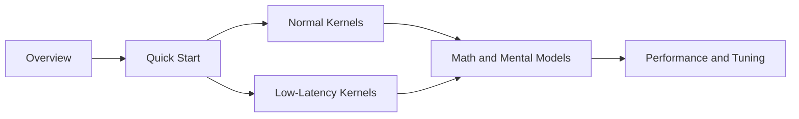

# DeepEP Documentation

This `docs/` tree is a source-driven learning path for the DeepEP repository. It is written from the code outward: the Python API in `deep_ep/`, the C++ runtime in `csrc/deep_ep.*`, the CUDA kernels in `csrc/kernels/`, and the validation logic in `tests/`.

## Choose your language

- [English documentation](en/README.md)

Chinese documentation will be added in a follow-up commit on the same `doc-260401` branch.

## What is covered

- What problem DeepEP solves for MoE expert parallelism.
- How `Buffer` maps onto the underlying CUDA/NVLink/RDMA runtime.
- Why the repository has two distinct kernel families: normal throughput kernels and low-latency kernels.
- How dispatch layout, buffer sizing, FP8 scaling, and low-latency double buffering work.
- How to tune the library on a real cluster and how to reason about the trade-offs.

## Suggested reading order

1. Start with the language index in `en/README.md` or `zh/README.md`.
2. Read `quick-start.md` to understand the setup and execution skeleton.
3. Read `architecture.md` for the bird's-eye view.
4. Read `normal-kernels.md` and `low-latency.md` depending on your workload.
5. Use `math-theory.md` and `performance-tuning.md` as the deeper reference layer.

## Source map behind these docs

The explanations in this directory are grounded mainly in:

- `README.md`
- `deep_ep/buffer.py`
- `deep_ep/utils.py`
- `csrc/deep_ep.hpp`
- `csrc/deep_ep.cpp`
- `csrc/config.hpp`
- `csrc/kernels/configs.cuh`
- `csrc/kernels/layout.cu`
- `csrc/kernels/intranode.cu`
- `csrc/kernels/internode.cu`
- `csrc/kernels/internode_ll.cu`
- `tests/test_intranode.py`
- `tests/test_internode.py`
- `tests/test_low_latency.py`
