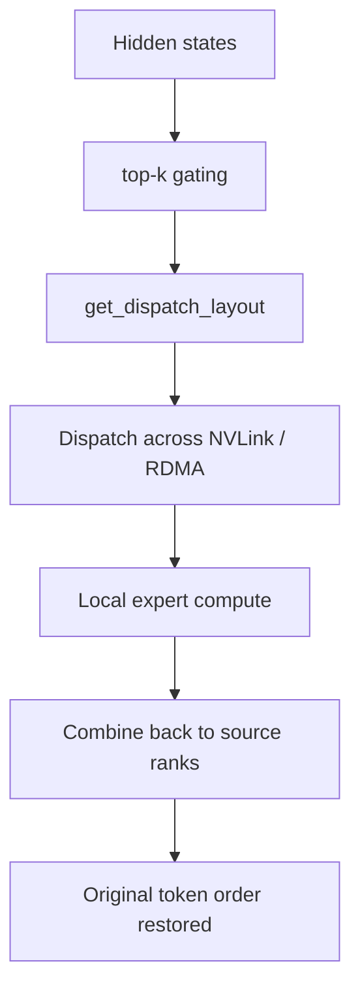

# DeepEP Documentation (English)

DeepEP is a communication engine for MoE expert parallelism. In one sentence: **the gate decides where each token should go, and DeepEP turns that routing plan into fast NVLink and RDMA traffic.**

## Reading map

- [Quick Start](quick-start.md): environment, installation, minimal usage, and sanity checks.
- [Architecture](architecture.md): the system layers, data plane, and source-code map.
- [Normal Kernels](normal-kernels.md): the training and prefilling path built around `get_dispatch_layout`, `dispatch`, and `combine`.
- [Low-Latency Kernels](low-latency.md): the decode-time path with IBGDA, hooks, and double buffering.
- [Math and Mental Models](math-theory.md): indicator matrices, prefix sums, FP8 scales, and buffer-size formulas explained from first principles.
- [Performance and Tuning](performance-tuning.md): topology assumptions, tuning knobs, and troubleshooting.

## If you only have 20 minutes

1. Read the first two sections of [Architecture](architecture.md).
2. Read the API skeleton in [Quick Start](quick-start.md).
3. Pick either [Normal Kernels](normal-kernels.md) or [Low-Latency Kernels](low-latency.md) based on your workload.

## If you are integrating DeepEP into a framework

Focus first on these repository surfaces:

- `deep_ep/buffer.py`: the public Python control plane.
- `deep_ep/utils.py`: event overlap and topology checks.
- `csrc/deep_ep.cpp`: the runtime boundary between Python and CUDA.
- `csrc/kernels/`: the actual transport and packing logic.
- `tests/`: concrete usage patterns and tuning harnesses.

## Why these docs are split this way

DeepEP is easiest to learn if you peel it layer by layer:

- business goal first: sparse MoE all-to-all is the real problem,
- then system shape: NVLink domain + RDMA domain,
- then API skeleton,
- then kernel families,
- and only then the math and tuning knobs.
