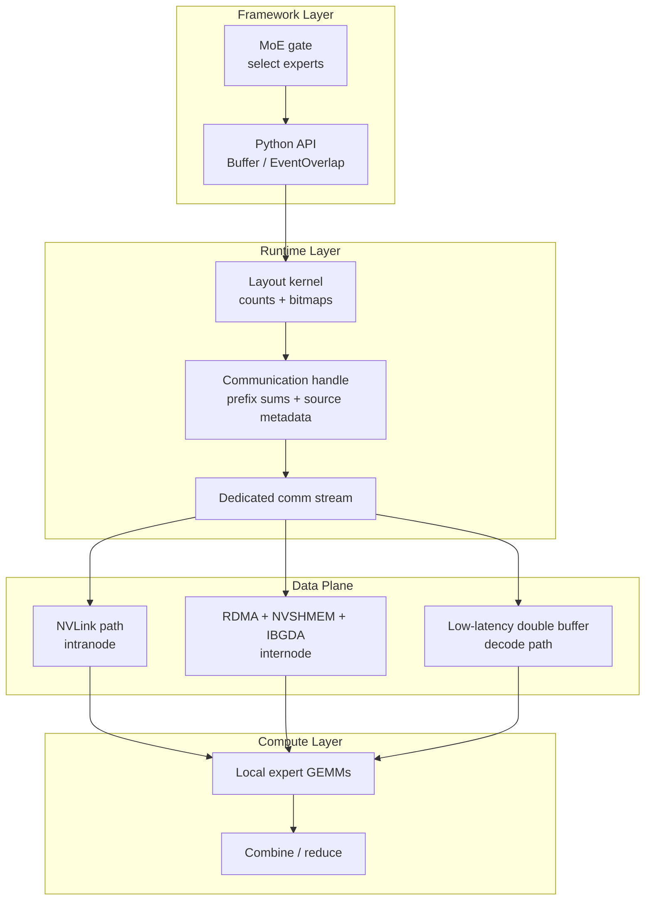
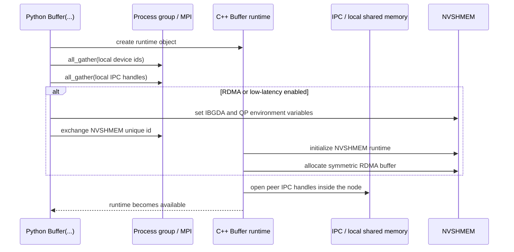

# DeepEP Architecture

## 1. DeepEP in plain English

Think of an MoE model as a city full of specialized repair shops:

- the **gate** decides which shops should see each package,
- the **experts** do the actual work,
- and **DeepEP** is the delivery network that moves packages between neighborhoods and cities.

Inside one node, the fast roads are **NVLink**. Across nodes, the long-haul highway is **RDMA**. DeepEP exists because MoE routing is sparse, irregular, and brutally bandwidth-hungry: every step turns into a structured all-to-all exchange.

## 2. The core problem DeepEP solves

A dense model keeps activations local. An MoE model does not.

For every token, the gate picks several experts. Those experts may live:

- on the same GPU,
- on another GPU in the same node,
- or on a GPU in another node.

That immediately creates three hard systems problems:

1. **Routing is sparse but dynamic.** Every batch produces a new token-to-expert pattern.
2. **The physical topology is asymmetric.** NVLink is much faster than RDMA, but RDMA is the only path across nodes.
3. **Training/prefill and decoding want different things.** Training wants throughput. Decoding wants tail latency.

DeepEP answers this by offering two kernel families:

| Kernel family | Primary goal | Fabric pattern | Best fit |
| --- | --- | --- | --- |
| Normal kernels | Maximize throughput | NVLink inside a node, RDMA forwarding across nodes | Training and inference prefilling |
| Low-latency kernels | Minimize latency | Pure RDMA with IBGDA, optional hook-based overlap | Inference decoding |

## 3. The layered architecture

### What each layer is responsible for

- **Python layer (`deep_ep/buffer.py`, `deep_ep/utils.py`)**
  - user-facing API,
  - setup logic,
  - layout calls,
  - dispatch/combine orchestration,
  - event overlap helpers.
- **C++ runtime (`csrc/deep_ep.hpp`, `csrc/deep_ep.cpp`)**
  - owns the communication buffers,
  - exchanges IPC and NVSHMEM state,
  - exposes a dedicated communication stream,
  - chooses the correct CUDA kernel path.
- **CUDA kernels (`csrc/kernels/*.cu*`)**
  - count where tokens should go,
  - build prefix sums and queue metadata,
  - move payloads over NVLink and RDMA,
  - reassemble or reduce results on the way back.

## 4. The initialization pipeline

The constructor of `Buffer` does much more than “allocate memory”. It turns the process group into a topology-aware runtime.

The most important pieces are:

- `check_nvlink_connections(...)` in `deep_ep/utils.py` rejects unsupported intranode topologies.
- `Buffer.__init__` in `deep_ep/buffer.py` gathers device IDs, IPC handles, and NVSHMEM IDs.
- `Buffer::sync` in `csrc/deep_ep.cpp` opens peer memory handles, allocates RDMA buffers, and marks the runtime as available.

## 5. The control plane vs. the data plane

A useful way to read DeepEP is to separate **planning** from **movement**.

### Control plane: deciding what should happen

This is the job of:

- `get_dispatch_layout(...)`
- prefix matrices
- source metadata
- communication handles

The output of the control plane is a precise answer to questions like:

- how many tokens does each rank receive?
- how many tokens does each local expert receive?
- which tokens must be sent to each rank?
- where should each sender write in the queue?

### Data plane: actually moving bytes

This is the job of:

- intranode NVLink queues,
- internode RDMA chunking and forwarding,
- low-latency IBGDA send/recv phases,
- combine-side reductions.

The control plane is why DeepEP can be dynamic. The data plane is why it can still be fast.

## 6. The source-code map

| File | Why it matters |
| --- | --- |
| `deep_ep/__init__.py` | Python import surface: `Buffer`, `EventOverlap`, `Config`, `topk_idx_t` |
| `deep_ep/buffer.py` | Main public API and mode selection logic |
| `deep_ep/utils.py` | Event wrapper and topology validation |
| `csrc/deep_ep.hpp` | Runtime interface and exposed operations |
| `csrc/deep_ep.cpp` | Pybind bridge, buffer ownership, stream orchestration |
| `csrc/config.hpp` | Hard constants such as `NUM_MAX_NVL_PEERS = 8` |
| `csrc/kernels/configs.cuh` | Config object and buffer size formulas |
| `csrc/kernels/layout.cu` | Layout kernel for per-rank and per-expert counts |
| `csrc/kernels/intranode.cu` | NVLink dispatch/combine implementation |
| `csrc/kernels/internode.cu` | RDMA forwarding path for normal kernels |
| `csrc/kernels/internode_ll.cu` | Decode-time low-latency protocol |
| `tests/*.py` | Usage examples, validation logic, and tuning loops |

## 7. Why handles are a first-class concept

DeepEP returns a **handle** from dispatch because the return path needs more than raw tensors. It needs the routing proof:

- prefix sums,
- source indices,
- channel offsets,
- RDMA-level metadata,
- and sometimes global rank prefix sums.

That handle is the bridge between “we scattered tokens out” and “we know exactly how to combine them back”.

## 8. What to read next

- If you want to run code quickly, go to [Quick Start](quick-start.md).
- If your workload is training or prefilling, go to [Normal Kernels](normal-kernels.md).
- If your workload is decode-time serving, go to [Low-Latency Kernels](low-latency.md).
- If you want the formulas behind the API, go to [Math and Mental Models](math-theory.md).
