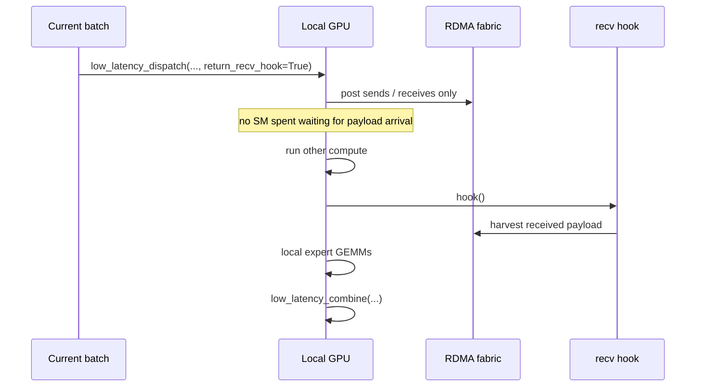
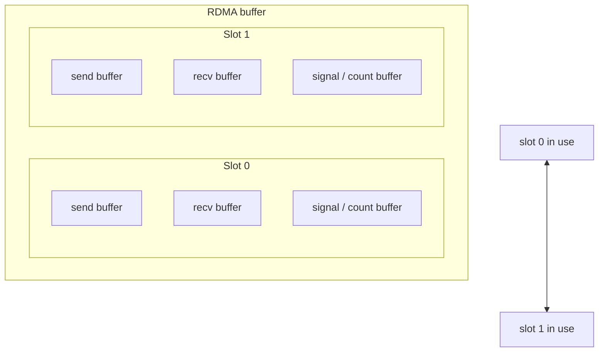

# Low-Latency Kernels: Decode-Time Path

The low-latency path exists for one reason: **serving cares about microseconds, not just aggregate bandwidth**.

Normal kernels are built to move a lot of data efficiently. Decode-time serving often wants something different:

- small batches,
- tight tail-latency budgets,
- and overlap between communication and compute without burning extra SMs.

That is exactly what the low-latency kernels in `csrc/kernels/internode_ll.cu` are built for.

## 1. When to use this path

Choose the low-latency mode when all of the following are true:

- you are in inference decoding,
- all participating ranks are reachable through RDMA,
- you care more about request latency than peak throughput,
- you can afford a larger persistent RDMA buffer.

## 2. The core idea

The key trick is that DeepEP can separate:

- **issuing the network work**, and
- **actually receiving / materializing the payload**.

That is why the API can return a hook.

## 3. The RDMA buffer is double-buffered on purpose

The low-latency layout in `csrc/kernels/configs.cuh` creates two symmetric slots. Think of them as **even** and **odd** lanes.

This is why the Python docs warn you not to hold more than **two** low-latency result tensors at once: the buffers are intentionally recycled.

## 4. API walkthrough

### `low_latency_dispatch(...)`

Inputs:

- BF16 hidden states,
- `topk_idx`,
- `num_max_dispatch_tokens_per_rank`,
- `num_experts`.

Outputs:

- packed received tensor(s),
- per-local-expert receive counts,
- a handle for combine,
- an optional event,
- an optional receive hook.

The handle contains:

- `src_info`,
- `layout_range`,
- `num_max_dispatch_tokens_per_rank`,
- `hidden`,
- `num_experts`.

That is enough information for `low_latency_combine(...)` to know how to put the results back.

### `low_latency_combine(...)`

Inputs:

- local expert outputs,
- original `topk_idx`,
- original `topk_weights`,
- the handle returned by dispatch.

Important options:

- `use_logfmt`: use the internal compressed format on the combine path,
- `zero_copy`: skip a copy when the next combine buffer is already populated,
- `out`: provide an explicit destination tensor,
- `return_recv_hook`: decouple network progress from receive materialization.

## 5. FP8, UE8M0, and why scales exist

Low-latency dispatch can optionally cast BF16 activations into FP8.

The important consequence is that the receive tensor may be returned as a tuple:

- FP8 payload tensor,
- scale tensor.

DeepEP stores scales per 128 hidden channels. That is the same mental model used by the helper conversion code in `tests/utils.py`.

If `round_scale=True`, the scales are rounded into powers of two. If `use_ue8m0=True`, the scale storage format becomes even more compact.

## 6. Hook-based overlap without extra SM usage

This is one of the nicest ideas in DeepEP.

Normally, “overlap communication with compute” means some compute resources are still spent polling or progressing the communication. DeepEP's low-latency design instead allows the network requests to sit in the background while the SMs do other work.

A good mental model is:

- **dispatch call**: mail the package and keep the tracking number,
- **other compute**: do useful work while the truck is on the road,
- **hook call**: open the door exactly when the delivery arrives.

## 7. Clean-up and shrink-mode controls

Low-latency mode exposes extra APIs because it is closer to production serving behavior.

### `clean_low_latency_buffer(...)`

Use this when the low-latency buffer might be dirty, especially after mixing normal and low-latency flows. Parts of the protocol assume zero-initialized regions.

### Mask buffer APIs

- `low_latency_update_mask_buffer(...)`
- `low_latency_query_mask_buffer(...)`
- `low_latency_clean_mask_buffer()`

These are tied to the timeout and failure-handling logic exercised in `tests/test_low_latency.py`.

The idea is simple: if a rank becomes unhealthy or times out, the protocol can mark it as masked so the rest of the system can keep moving.

## 8. Why low-latency mode uses more memory

The low-latency buffer is big because it must keep enough space for:

- send messages,
- receive messages,
- signaling state,
- and double buffering.

It is essentially pre-paying memory in order to buy down control-flow latency later.

## 9. Practical checklist before you enable it

- Make sure RDMA is visible from every participating rank.
- Set `num_qps_per_rank` equal to the number of local experts for best performance.
- Keep `num_max_dispatch_tokens_per_rank` realistic; the README suggests staying below 256 for decoding engines.
- Remember that the persistent RDMA buffer must be large enough for the worst expected decode-time shape.
- If you mix normal and low-latency kernels, clean the low-latency buffer before reusing it.

## 10. Source files worth reading together

- `deep_ep/buffer.py` for the public API and returned tuple shapes,
- `csrc/kernels/configs.cuh` for the low-latency memory layout,
- `csrc/kernels/internode_ll.cu` for send/recv phases, masking, and statistics,
- `tests/test_low_latency.py` for real usage patterns and failure simulation.
