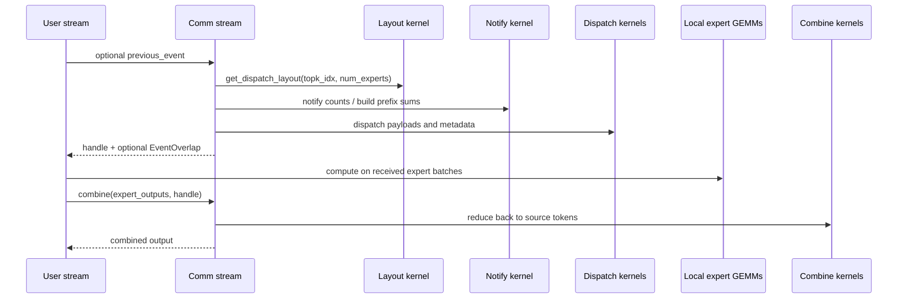
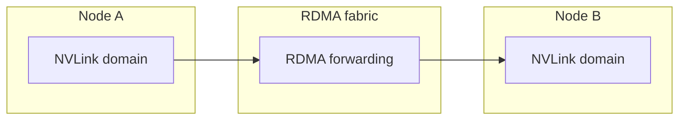

# Normal Kernels: Training and Prefill Path

DeepEP calls the throughput-oriented path the **normal kernels**. They are the right default for:

- training,
- forward-only prefilling,
- and any workload where overall bandwidth matters more than raw decode latency.

## 1. The big picture

The separation between `get_dispatch_layout(...)`, `dispatch(...)`, and `combine(...)` is not accidental. It mirrors the real work:

1. count the destinations,
2. move the payloads,
3. reduce the results back.

## 2. Why layout is a separate step

The gate tells you the **experts**. The transport needs the **ranks** and **counts**.

For each token, DeepEP first asks:

- which ranks does this token need to visit?
- how many tokens are going to each rank?
- how many tokens will each expert receive?

The layout kernel in `csrc/kernels/layout.cu` computes exactly those answers and returns:

- `num_tokens_per_rank`,
- `num_tokens_per_rdma_rank` for internode mode,
- `num_tokens_per_expert`,
- `is_token_in_rank`.

### The subtle point many readers miss

`is_token_in_rank[t, r]` is a **boolean**, not a count.

That means if one token chooses two experts that both live on the same rank, DeepEP still sends that token to that rank only **once**. This is why the layout stage is not just bookkeeping: it removes redundant traffic before the real transport begins.

## 3. A tiny concrete example

Assume:

- 8 experts total,
- 4 ranks,
- 2 experts per rank.

So the expert-to-rank mapping is:

- rank 0 owns experts 0 and 1,
- rank 1 owns experts 2 and 3,
- rank 2 owns experts 4 and 5,
- rank 3 owns experts 6 and 7.

Now suppose the gate outputs:

| Token | Selected experts | Destination ranks | `is_token_in_rank` row |
| --- | --- | --- | --- |
| `t0` | `[1, 6]` | `[0, 3]` | `[1, 0, 0, 1]` |
| `t1` | `[0, 2]` | `[0, 1]` | `[1, 1, 0, 0]` |
| `t2` | `[3, 7]` | `[1, 3]` | `[0, 1, 0, 1]` |
| `t3` | `[4, -1]` | `[2]` | `[0, 0, 1, 0]` |

Then:

- `num_tokens_per_rank = [2, 2, 1, 2]`
- `num_tokens_per_expert` is counted per exact expert id.

That is the shipping manifest the runtime needs.

## 4. What happens inside `dispatch(...)`

The Python method chooses between two implementations:

- **intranode dispatch** if everything is inside the NVLink domain,
- **internode dispatch** if RDMA ranks are involved.

### Intranode path

The kernel family in `csrc/kernels/intranode.cu` uses:

- per-rank shared queues in NVLink-visible buffers,
- barriers between local peers,
- per-channel prefix sums,
- and separate sender / receiver responsibilities.

A useful mental model is: **each channel is a train car**.

- The layout stage decides how many parcels each destination needs.
- Prefix sums assign each sender a seat range inside the correct car.
- Senders write payloads into those seat ranges.
- Receivers read a contiguous block back out.

### Internode path

The kernel family in `csrc/kernels/internode.cu` adds one more level:

- aggregate traffic in the NVLink domain,
- forward across RDMA between matching GPU indices,
- then fan back out locally.

That is why the README describes it as **forwarding from the NVLink domain to the RDMA domain**.

## 5. What is inside the returned handle

The normal-kernel handle is the minimum information needed to reverse the dispatch later.

### Intranode handle

The Python code returns a tuple containing values such as:

- `rank_prefix_matrix`
- `channel_prefix_matrix`
- `recv_channel_prefix_matrix`
- `recv_src_idx`
- `is_token_in_rank`
- `send_head`

Broadly speaking:

- **prefix matrices** say where each sender should write and where each receiver should read,
- **source indices** preserve the mapping back to original token order,
- **send heads** maintain queue progress.

### Internode handle

The internode handle grows to include RDMA-specific pieces, such as:

- RDMA channel prefix matrices,
- global rank prefix sums,
- received source metadata,
- RDMA and NVLink send heads.

The extra fields exist because the transport now has to remember both the cross-node hop and the intra-node fan-out.

## 6. Why `combine(...)` is not just “the reverse of dispatch”

Conceptually it is the reverse, but operationally it is a **reduction**.

- `dispatch(...)` copies one token to every rank that owns one of its selected experts.
- `combine(...)` gathers those expert outputs back and reduces them into the original token order.

If `topk_weights` are provided, DeepEP reduces with those weights. If `bias` is provided, DeepEP adds it after the reduction.

This is why the repository examples say:

- the backward of dispatch is combine,
- and the backward of combine is dispatch.

The transport graph is symmetric, but the algebra on the payload is not.

## 7. Asynchrony and overlap

The normal path supports two useful overlap mechanisms.

### `previous_event`

Pass an `EventOverlap` if the communication should wait for some previous compute.

### `async_finish=True`

Return as soon as the work is launched on the communication stream, then wait later only when needed.

This is especially useful if you want to overlap expert GEMMs or some other stream-local work with the outstanding communication.

## 8. Why there can be a CPU wait

For the exact normal dispatch path, the current rank may not know the final receive count immediately. The runtime therefore waits for a GPU-side signal that says “the count is ready”.

That is why the README explicitly warns that the exact path is not CUDA-graph friendly in the general case.

### The escape hatch: `num_worst_tokens`

If you can afford a worst-case receive buffer size, you can pass `num_worst_tokens` (intranode only). That avoids the CPU sync because the receiver no longer waits for the exact count before continuing.

The trade-off is simple:

- **exact count** -> less memory, possible CPU wait,
- **worst-case count** -> more memory, graph-friendlier control flow.

## 9. Where to read the code

If you want to align the prose with the implementation, focus on:

- `deep_ep/buffer.py` for the public API and tuple layout,
- `csrc/deep_ep.cpp` for stream orchestration and type checks,
- `csrc/kernels/layout.cu` for count generation,
- `csrc/kernels/intranode.cu` for local queueing,
- `csrc/kernels/internode.cu` for RDMA forwarding.

## 10. Recommended next page

If the formulas behind the layout and counts still feel abstract, continue with [Math and Mental Models](math-theory.md).
