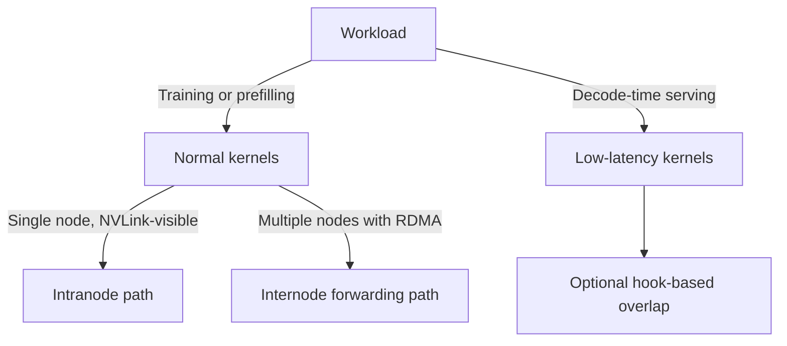

# Performance and Tuning

This page is about turning DeepEP from “it works” into “it matches the topology and workload I actually have”.

## 1. First choose the right kernel family

The most common tuning mistake is trying to solve a latency problem with the throughput kernel family or vice versa.

## 2. Hard topology assumptions

DeepEP is fast partly because it makes strong assumptions.

| Assumption | Why it matters |
| --- | --- |
| `NUM_MAX_NVL_PEERS = 8` | The code is structured around an 8-GPU NVLink domain |
| NVLink visible inside the node | Required for intranode normal kernels |
| RDMA available across nodes | Required for internode normal kernels and low-latency mode |
| NVSHMEM available | Required for RDMA-backed features |
| Even `num_sms` for normal kernels | The runtime uses `num_channels = num_sms / 2` |
| QPs per rank should match local experts in low-latency mode | Best throughput/latency balance for decode path |

## 3. Published knobs that really matter

### Runtime knobs

| Knob | Surface | Effect |
| --- | --- | --- |
| `Buffer.set_num_sms(...)` | Python API | Controls how many SMs normal kernels may consume |
| `Buffer.get_dispatch_config(...)` | Python API | Recommended normal-kernel dispatch chunk sizes |
| `Buffer.get_combine_config(...)` | Python API | Recommended normal-kernel combine chunk sizes |
| `num_qps_per_rank` | `Buffer(...)` constructor | Controls RDMA parallelism in low-latency mode |
| `allow_nvlink_for_low_latency_mode` | `Buffer(...)` constructor | Allows NVLink assistance in low-latency mode |
| `enable_shrink` | `Buffer(...)` constructor | Enables dynamic masking of unhealthy ranks |

### Build and deployment knobs

| Knob | Effect |
| --- | --- |
| `NVSHMEM_DIR` | Enables NVSHMEM-backed features |
| `TORCH_CUDA_ARCH_LIST` | Chooses target GPU architecture |
| `DISABLE_SM90_FEATURES` | Disables Hopper-specific features |
| `DISABLE_AGGRESSIVE_PTX_INSTRS` | Disables aggressive PTX loads/stores when compatibility is more important than speed |
| `NVSHMEM_IB_SL` | Assigns InfiniBand virtual lanes for traffic isolation |

## 4. What the tuning tests already do for you

The repository tests are not just correctness checks. They are also tuning harnesses.

- `tests/test_intranode.py` sweeps SM counts and NVLink chunk sizes.
- `tests/test_internode.py` sweeps NVLink and RDMA chunk sizes for the forwarding path.
- `tests/test_low_latency.py` measures dispatch/combine bandwidth and hook-based timing split.
- `tests/utils.py` provides `bench(...)` and `bench_kineto(...)` helpers.

That means the recommended workflow is:

1. make the topology correct,
2. run the right test for your path,
3. record the best chunk sizes on your cluster,
4. feed those configs back into your framework integration.

## 5. Network settings that matter in production

The repository README gives three practical deployment recommendations.

### Traffic isolation

Use InfiniBand virtual lanes to separate:

- normal-kernel traffic,
- low-latency traffic,
- and everything else.

The relevant environment variable is `NVSHMEM_IB_SL`.

### Adaptive routing

Use adaptive routing when the fabric is busy and static routing when the fabric is light. The trade-off is straightforward:

- adaptive routing lowers congestion,
- static routing lowers added latency.

### Congestion control

The README notes that congestion control is disabled in the authors' production environment because they did not see major benefit.

## 6. Interpreting the knobs physically

It helps to think in physical terms, not just API terms.

- `num_sms`: how much compute silicon you are willing to spend on communication.
- chunk size: how much payload each channel moves before rotating.
- QPs per rank: how many parallel doors the NIC exposes per rank.
- `num_max_dispatch_tokens_per_rank`: the largest decode burst the low-latency buffer must survive.

If a knob feels mysterious, translate it into one of those physical interpretations.

## 7. Common symptoms and likely causes

| Symptom | Likely cause |
| --- | --- |
| Intranode path fails on some machines | GPUs are not fully NVLink-visible; check topology first |
| Low-latency path works but uses too much memory | `num_max_dispatch_tokens_per_rank` is overprovisioned |
| Decode overlap shows little benefit | hook split does not match your compute stages, or NVLink assistance conflicts with overlap expectations |
| Internode throughput is disappointing | RDMA chunk sizes and SL/routing are mismatched to the cluster |
| Wrong results on unusual platforms | disable aggressive PTX instructions and retest |

## 8. The undefined-PTX note is worth taking seriously

DeepEP explicitly documents an aggressive PTX trick around non-coherent loads with `.L1::no_allocate`. The README explains why it was adopted and also provides the safety switch:

- if a platform behaves oddly,
- set `DISABLE_AGGRESSIVE_PTX_INSTRS=1`,
- and prefer correctness over the last bit of speed.

That is a classic HPC trade-off: exotic instructions can buy speed, but they make portability harder.

## 9. A practical tuning order

If you are tuning a fresh cluster, use this order:

1. Verify build flags and GPU architecture.
2. Verify NVLink visibility locally.
3. Verify RDMA and NVSHMEM visibility globally.
4. Tune the normal or low-latency path, not both at once.
5. Sweep chunk sizes before making code changes.
6. Only after transport is healthy, revisit expert GEMM overlap.

That ordering prevents a lot of wasted debugging time.

## 10. Final rule of thumb

DeepEP performance comes from matching the software path to the physical topology.

If you remember one sentence from this page, remember this one:

> **Treat NVLink, RDMA, and SM budget as separate resources, then tune DeepEP so each one is spent where it is strongest.**
