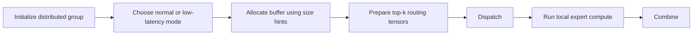

# Quick Start

This page is the shortest path from “I just cloned DeepEP” to “I understand the API skeleton and know what must be configured on a real cluster”.

## 1. Requirements checklist

From the repository `README.md` and `setup.py`, the practical requirements are:

- Ampere (SM80) or Hopper (SM90) class GPUs.
- Python 3.8+.
- PyTorch 2.1+.
- CUDA 11+ for SM80, CUDA 12.3+ for SM90 features.
- NVLink for intranode kernels.
- RDMA for internode and low-latency kernels.
- NVSHMEM for any RDMA-backed feature.

If you only care about intranode NVLink kernels, DeepEP can still build without NVSHMEM, but internode and low-latency functionality will be disabled.

## 2. Build and installation

### Development build

```bash
NVSHMEM_DIR=/path/to/installed/nvshmem python setup.py build
ln -s build/lib.linux-x86_64-cpython-38/deep_ep_cpp.cpython-38-x86_64-linux-gnu.so
```

### Install into the environment

```bash
NVSHMEM_DIR=/path/to/installed/nvshmem python setup.py install
```

### Important build-time environment variables

| Variable | Meaning | Where it is used |
| --- | --- | --- |
| `NVSHMEM_DIR` | Path to NVSHMEM installation | `setup.py`, constructor setup |
| `DISABLE_SM90_FEATURES` | Disable Hopper-specific features | `setup.py`, `csrc/config.hpp` |
| `TORCH_CUDA_ARCH_LIST` | Target architecture list, e.g. `9.0` | `setup.py` |
| `DISABLE_AGGRESSIVE_PTX_INSTRS` | Disable aggressive PTX load/store tricks | `setup.py`, low-level kernels |
| `TOPK_IDX_BITS` | Choose 32-bit or 64-bit expert indices | `setup.py`, `csrc/config.hpp` |
| `NVSHMEM_IB_SL` | InfiniBand service level / virtual lane selection | runtime deployment |

## 3. Execution skeleton



You can learn almost the whole API from that graph.

## 4. Minimal normal-kernel usage

```python
import torch
import torch.distributed as dist
from deep_ep import Buffer

# Tune throughput kernels: even number only.
Buffer.set_num_sms(24)

group = dist.group.WORLD
hidden_bytes = hidden * 2  # BF16 is 2 bytes per element

dispatch_cfg = Buffer.get_dispatch_config(group.size())
combine_cfg = Buffer.get_combine_config(group.size())
num_nvl_bytes = max(
    dispatch_cfg.get_nvl_buffer_size_hint(hidden_bytes, group.size()),
    combine_cfg.get_nvl_buffer_size_hint(hidden_bytes, group.size()),
)
num_rdma_bytes = max(
    dispatch_cfg.get_rdma_buffer_size_hint(hidden_bytes, group.size()),
    combine_cfg.get_rdma_buffer_size_hint(hidden_bytes, group.size()),
)

buffer = Buffer(group, num_nvl_bytes, num_rdma_bytes)
num_tokens_per_rank, num_tokens_per_rdma_rank, num_tokens_per_expert, is_token_in_rank, layout_event = \
    buffer.get_dispatch_layout(topk_idx, num_experts)

recv_x, recv_topk_idx, recv_topk_weights, local_expert_counts, handle, event = buffer.dispatch(
    x,
    topk_idx=topk_idx,
    topk_weights=topk_weights,
    num_tokens_per_rank=num_tokens_per_rank,
    num_tokens_per_rdma_rank=num_tokens_per_rdma_rank,
    is_token_in_rank=is_token_in_rank,
    num_tokens_per_expert=num_tokens_per_expert,
)

# ... run local expert GEMMs on recv_x ...

combined_x, combined_topk_weights, event = buffer.combine(
    expert_outputs,
    handle,
    topk_weights=recv_topk_weights,
)
```

### Mental model of the arguments

- `topk_idx` says which experts each token wants.
- `get_dispatch_layout(...)` turns that into a shipping manifest.
- `dispatch(...)` ships the tokens.
- `handle` is the receipt that allows `combine(...)` to undo the routing later.

## 5. Minimal low-latency usage

```python
from deep_ep import Buffer

num_rdma_bytes = Buffer.get_low_latency_rdma_size_hint(
    num_max_dispatch_tokens_per_rank,
    hidden,
    group.size(),
    num_experts,
)

buffer = Buffer(
    group,
    0,
    num_rdma_bytes,
    low_latency_mode=True,
    num_qps_per_rank=num_experts // group.size(),
)

recv_x, recv_count, handle, event, hook = buffer.low_latency_dispatch(
    hidden_states,
    topk_idx,
    num_max_dispatch_tokens_per_rank,
    num_experts,
    return_recv_hook=True,
)

# Overlap other work here if you want.
hook()

combined_x, event, hook = buffer.low_latency_combine(
    expert_outputs,
    topk_idx,
    topk_weights,
    handle,
    return_recv_hook=True,
)

hook()
```

Low-latency mode is different in three important ways:

- it needs much larger RDMA buffer space,
- it is optimized around decode-time latency instead of peak throughput,
- and it can split “post the traffic” from “harvest the arrival” by returning a hook.

## 6. What `EventOverlap` is for

`EventOverlap` is a tiny wrapper over a CUDA event. Use it when you want the communication stream and the compute stream to depend on each other without globally synchronizing the device.

In practice:

- `previous_event` lets DeepEP wait for some earlier compute to finish,
- `async_finish=True` lets the call return before the communication stream is fully done,
- `current_stream_wait()` lets your current stream wait only when you choose.

## 7. Cluster and topology sanity checks

Before blaming DeepEP, check the physical assumptions:

- Are the local GPUs actually connected by NVLink?
- Are you running on the correct CUDA architecture target?
- Is NVSHMEM installed and visible?
- Is your process group initialized with the correct world size and ranks?
- For low-latency mode, does `num_qps_per_rank` equal the number of local experts?

The helper `check_nvlink_connections(...)` in `deep_ep/utils.py` exists exactly because some GPU topologies look similar from the outside but are not valid for the intranode kernels.

## 8. Tests and validation harnesses

The repository already includes cluster-side validation programs:

```bash
python tests/test_intranode.py
python tests/test_internode.py
python tests/test_low_latency.py
```

Also note the warning in `tests/utils.py`: the `init_dist(...)` helper is intentionally simple and may need to be rewritten for your cluster launcher.

## 9. Where to go next

- Use [Architecture](architecture.md) if you want the system map.
- Use [Normal Kernels](normal-kernels.md) if you are integrating training or prefilling.
- Use [Low-Latency Kernels](low-latency.md) if you are integrating decoding.
