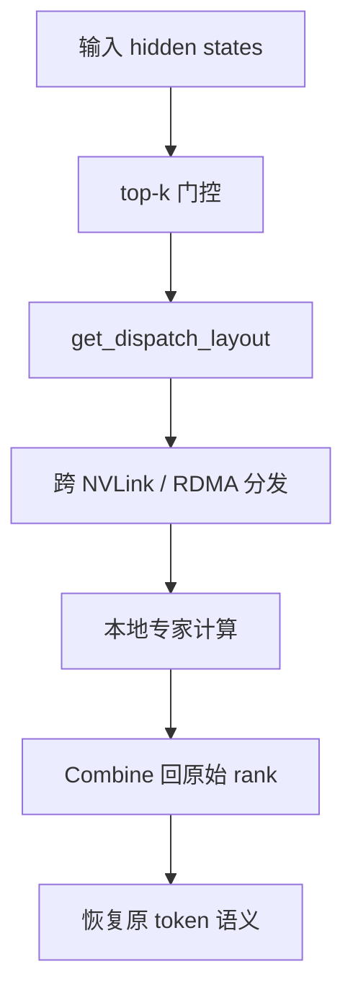

# DeepEP 文档（中文）

DeepEP 是一个面向 MoE 专家并行通信的底层引擎。最直白地说：**门控负责决定 token 要去哪些专家，DeepEP 负责把这张“派件单”变成足够快的 NVLink 与 RDMA 通信。**

## 阅读导航

- [快速开始](quick-start.md)：环境、安装、最小用法、基础排障。
- [架构总览](architecture.md)：系统分层、数据平面、源码地图。
- [普通内核路径](normal-kernels.md)：训练 / prefill 场景下的 `get_dispatch_layout`、`dispatch`、`combine`。
- [低延迟内核路径](low-latency.md)：解码场景下的 IBGDA、hook、双缓冲机制。
- [数学与直觉](math-theory.md)：指标矩阵、前缀和、FP8 scale、buffer 公式的“降维打击”解释。
- [性能与调优](performance-tuning.md)：拓扑假设、关键调参项、集群部署建议。

## 如果你只想先抓主线

1. 先读 [架构总览](architecture.md) 前两节。
2. 再看 [快速开始](quick-start.md) 的 API 骨架。
3. 根据你的工作负载选择 [普通内核路径](normal-kernels.md) 或 [低延迟内核路径](low-latency.md)。

## 如果你要把 DeepEP 接进训练框架或服务框架

优先盯住这几个源码面：

- `deep_ep/buffer.py`：公共 Python 控制面。
- `deep_ep/utils.py`：事件重叠与拓扑检查。
- `csrc/deep_ep.cpp`：Python 到 CUDA 的运行时边界。
- `csrc/kernels/`：真正执行通信与打包的内核。
- `tests/`：现成的使用范式与调优入口。

## 为什么文档要分成这几层

DeepEP 最怕一上来就扎进 CUDA 细节。更好的学习顺序是：

- 先明白业务问题：MoE 稀疏 all-to-all 为什么难，
- 再看系统骨架：NVLink 域 + RDMA 域，
- 再看 API，
- 然后再下钻到两套 kernel 家族，
- 最后再补数学与调优。
