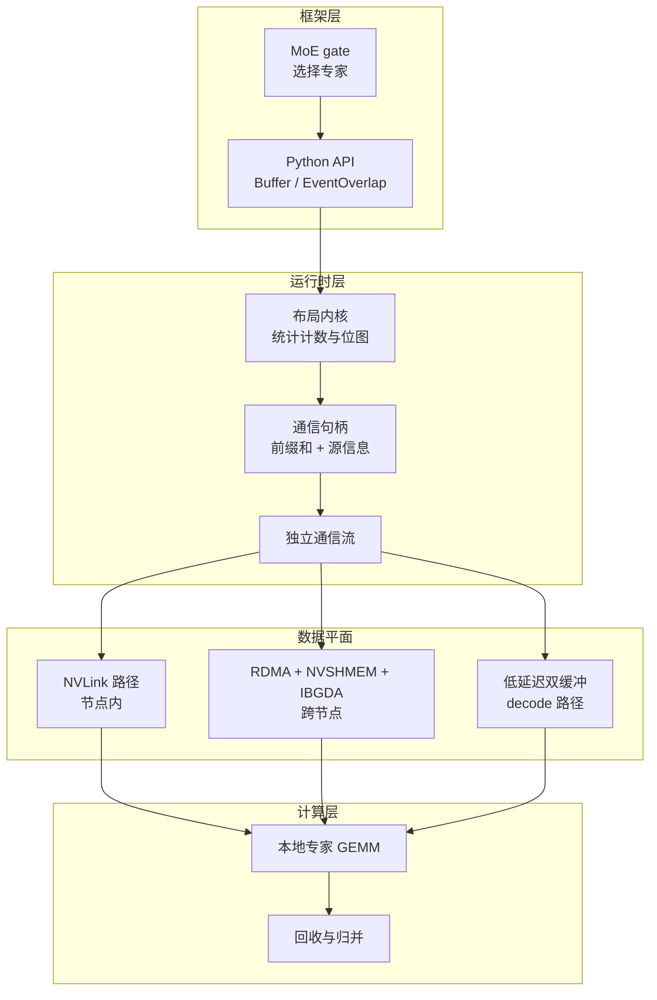
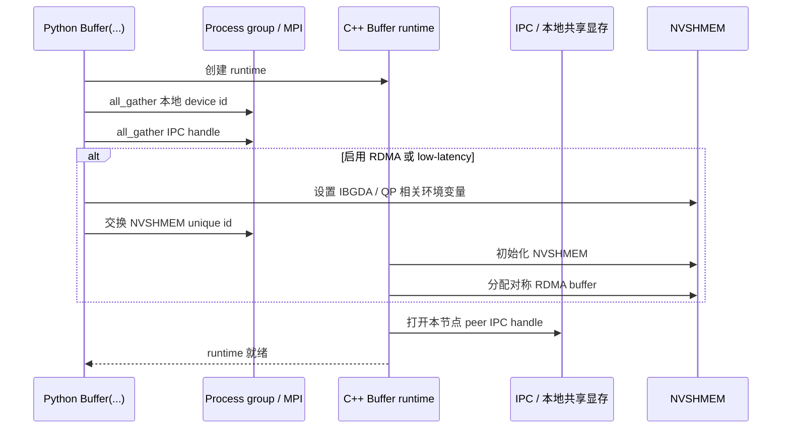

# DeepEP 架构总览

## 1. 先用人话讲清楚它到底在干什么

你可以把一个 MoE 模型想象成一座城市里的“专科门诊系统”：

- **门控（gate）** 决定每个 token 该去看哪几个专科医生；
- **专家（experts）** 负责真正做计算；
- **DeepEP** 则是那个把病人从不同街区、不同城市送到对应门诊的高效交通网络。

在一台机器内部，最快的路是 **NVLink**；跨机器时，长途主干道是 **RDMA**。DeepEP 的存在意义，就是把 MoE 这种“每一步都在动态换路由”的稀疏 all-to-all 通信，做得尽量快、尽量稳。

## 2. DeepEP 真正解决的痛点

稠密模型里，大多数激活都留在本地。MoE 不一样。

对每个 token 来说，门控会选出若干专家，这些专家可能：

- 就在当前 GPU 上，
- 在同机的另一张 GPU 上，
- 也可能在另一台机器的 GPU 上。

于是立刻出现三大系统级难题：

1. **路由是稀疏的，但又是动态的。** 每个 batch 的 token-to-expert 映射都可能不同。
2. **物理拓扑是不对称的。** NVLink 很快，RDMA 慢得多，但跨节点只能走 RDMA。
3. **训练 / prefill 与 decoding 的诉求完全不同。** 前者要吞吐，后者要低延迟。

DeepEP 的回答是：不要用一套 kernel 硬扛所有场景，而是拆成两大家族。

| 内核家族 | 主要目标 | 典型通信形态 | 适用场景 |
| --- | --- | --- | --- |
| 普通内核 | 吞吐优先 | 节点内 NVLink，节点间 RDMA forwarding | 训练、prefill |
| 低延迟内核 | 时延优先 | 基于 IBGDA 的纯 RDMA 路径 | decoding |

## 3. 系统分层图

### 每一层分别管什么

- **Python 层（`deep_ep/buffer.py`, `deep_ep/utils.py`）**
  - 暴露用户 API；
  - 完成初始化；
  - 发起 layout / dispatch / combine；
  - 管理事件重叠。
- **C++ 运行时层（`csrc/deep_ep.hpp`, `csrc/deep_ep.cpp`）**
  - 持有通信 buffer；
  - 同步 IPC 与 NVSHMEM 状态；
  - 管理独立的 communication stream；
  - 决定走哪条 CUDA kernel 路径。
- **CUDA kernel 层（`csrc/kernels/*.cu*`）**
  - 统计 token 该去哪里；
  - 建前缀和与队列元数据；
  - 在 NVLink / RDMA 上搬运载荷；
  - 再把结果收拢回原始 token 语义。

## 4. 初始化并不只是“分配显存”

`Buffer(...)` 的构造过程，本质上是在把一个普通的 process group 变成一个“知道拓扑、知道 peer、知道 RDMA 状态”的专用通信运行时。

这里最关键的几个动作是：

- `check_nvlink_connections(...)` 会先否决不满足条件的节点内拓扑；
- `Buffer.__init__` 会 gather device id、IPC handle、NVSHMEM unique id；
- `Buffer::sync` 才是真正把 peer 映射、RDMA buffer、mask buffer 等全部接好。

## 5. 把 DeepEP 分成“控制面”和“数据面”最容易看懂

### 控制面：先决定“应该怎么发”

控制面的核心产物包括：

- `get_dispatch_layout(...)` 的返回值；
- 前缀和矩阵；
- source metadata；
- handle。

它回答的问题是：

- 每个 rank 最后会收到多少 token？
- 每个 expert 会收到多少 token？
- 哪些 token 需要被发到哪个 rank？
- 每个 sender 应该把数据写到队列的哪个位置？

### 数据面：再决定“怎么把字节搬过去”

这一层才是真正消耗 NVLink、RDMA、SM 资源的地方，包括：

- intranode NVLink 队列；
- internode RDMA chunk forwarding；
- low-latency 的 send/recv phase；
- combine 侧的 reduce。

一句话：**控制面负责算路，数据面负责跑车。**

## 6. 源码地图

| 文件 | 作用 |
| --- | --- |
| `deep_ep/__init__.py` | Python 导入面：`Buffer`、`EventOverlap`、`Config`、`topk_idx_t` |
| `deep_ep/buffer.py` | 最主要的用户 API 与模式分发逻辑 |
| `deep_ep/utils.py` | 事件封装与 NVLink 拓扑检查 |
| `csrc/deep_ep.hpp` | C++ 侧公开接口 |
| `csrc/deep_ep.cpp` | pybind 绑定、buffer 生命周期、stream 协调 |
| `csrc/config.hpp` | 核心常量，比如 `NUM_MAX_NVL_PEERS = 8` |
| `csrc/kernels/configs.cuh` | Config 参数与 buffer 大小公式 |
| `csrc/kernels/layout.cu` | dispatch layout 统计内核 |
| `csrc/kernels/intranode.cu` | 节点内 NVLink dispatch / combine |
| `csrc/kernels/internode.cu` | 普通内核下的跨节点 forwarding |
| `csrc/kernels/internode_ll.cu` | 低延迟 decode 路径 |
| `tests/*.py` | 用法、校验和调优范式 |

## 7. 为什么 handle 是一等公民

DeepEP 在 `dispatch(...)` 之后返回 handle，不是为了“显得高级”，而是因为回程 combine 真的离不开它。

handle 里装的是回程所需的“证据链”：

- 前缀和，
- source index，
- channel offset，
- RDMA 元数据，
- 某些场景下还有 global rank prefix sum。

没有这份“快递底单”，你根本无法高效地把 expert 输出精确地拼回原始 token 顺序。

## 8. 接下来该读哪一页

- 想快速跑起来：看 [快速开始](quick-start.md)
- 你的场景是训练 / prefill：看 [普通内核路径](normal-kernels.md)
- 你的场景是 decoding 服务：看 [低延迟内核路径](low-latency.md)
- 想把公式真正看透：看 [数学与直觉](math-theory.md)
