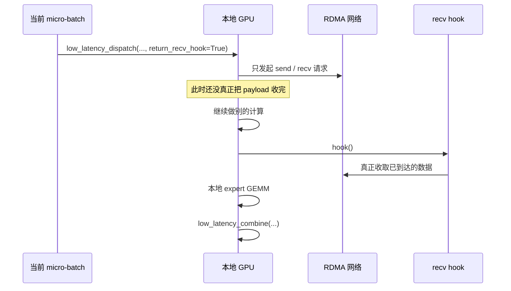
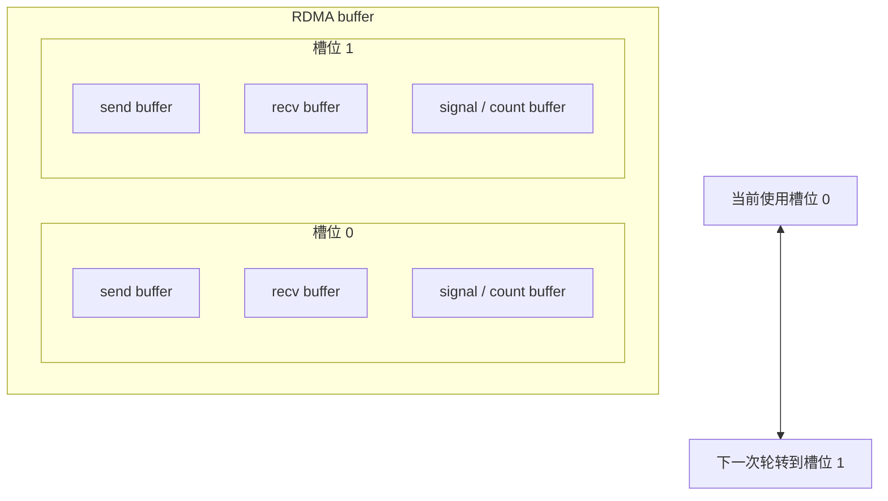

# 低延迟内核路径：Decode 场景

低延迟路径存在的唯一理由，就是一句话：**在线服务看的是微秒级尾延迟，而不是单纯总吞吐。**

普通内核擅长把大量数据搬得很高效；但 decode 场景更常见的是：

- batch 小；
- latency budget 极紧；
- 希望通信与计算重叠，但又不愿意额外吃掉太多 SM。

这正是 `csrc/kernels/internode_ll.cu` 这套 low-latency kernel 被设计出来的背景。

## 1. 什么时候该用这条路径

当下面条件同时满足时，优先考虑 low-latency 模式：

- 你在做 inference decoding；
- 所有参与 rank 都能通过 RDMA 互通；
- 你更在意单次请求延迟，而不是绝对吞吐；
- 你能接受更大的持久化 RDMA buffer。

## 2. 核心思想一图看懂

这套设计最厉害的地方在于，它可以把：

- **网络请求的发起**，和
- **payload 的真正收取与 materialize**

拆成两个阶段。

所以 API 才能返回一个 hook。

## 3. 为什么 RDMA buffer 必须双缓冲

`csrc/kernels/configs.cuh` 里的 `LowLatencyLayout` 明确把低延迟 buffer 设计成两套对称槽位。你可以把它想成 **奇偶两条跑道**。

这也就是为什么 Python 文档会提醒你：**同一时刻不要长期持有超过两个 low-latency 结果张量。** 因为底层 buffer 本来就是循环复用的。

## 4. API 分解

### `low_latency_dispatch(...)`

输入：

- BF16 hidden states；
- `topk_idx`；
- `num_max_dispatch_tokens_per_rank`；
- `num_experts`。

输出：

- 打包后的接收张量；
- 每个本地 expert 的接收计数；
- combine 所需 handle；
- 可选 event；
- 可选 recv hook。

这个 handle 里一般包含：

- `src_info`
- `layout_range`
- `num_max_dispatch_tokens_per_rank`
- `hidden`
- `num_experts`

足以让 combine 知道后续该如何把结果还原回去。

### `low_latency_combine(...)`

输入：

- 本地 expert 输出；
- 原始 `topk_idx`；
- 原始 `topk_weights`；
- dispatch 返回的 handle。

关键选项包括：

- `use_logfmt`：combine 路径启用内部压缩格式；
- `zero_copy`：若下一次 combine buffer 已经就位，可跳过一次复制；
- `out`：直接写入指定输出张量；
- `return_recv_hook`：把网络发送与数据接收拆开。

## 5. FP8、UE8M0 和 scale 到底是什么关系

low-latency dispatch 可以把 BF16 激活按块 cast 成 FP8。

于是返回值就可能不是一个 tensor，而是一对：

- FP8 payload tensor；
- scale tensor。

DeepEP 的 scale 通常按每 128 个 hidden channel 存一次，这和 `tests/utils.py` 里的参考 cast / back-cast 逻辑是一致的。

如果 `round_scale=True`，scale 会被量化成 2 的幂；如果 `use_ue8m0=True`，scale 的存储还会进一步压缩。

## 6. hook 重叠为什么厉害

这是 DeepEP 非常漂亮的一点设计。

很多系统里说“通信和计算重叠”，本质上只是让 SM 在一边算一边还得分神维护通信进度。DeepEP 的低延迟路径则希望做到：**网络在后台飞，SM 尽量专心做计算。**

你可以把它理解成：

- `dispatch`：先把快递寄出去，拿到运单号；
- 中间计算：趁快递还在路上，先干别的；
- `hook()`：等真正到货时，再开门签收。

## 7. 清理接口与 shrink 模式

低延迟模式额外暴露了一组接口，是因为它更贴近真实在线服务环境。

### `clean_low_latency_buffer(...)`

当 low-latency buffer 有可能被污染时一定要清。尤其是你在普通路径和低延迟路径之间来回切时，部分协议区域默认假设自己是零初始化的。

### mask buffer 相关接口

- `low_latency_update_mask_buffer(...)`
- `low_latency_query_mask_buffer(...)`
- `low_latency_clean_mask_buffer()`

这几组接口对应的是 `tests/test_low_latency.py` 里模拟 rank 故障与 shrink 的逻辑。

直观地说：如果某个 rank 超时或挂了，协议可以先把它标成 masked，让剩余系统尽量继续向前跑。

## 8. 为什么 low-latency 模式更吃内存

因为它本质上是在用更多静态预留内存，换取更低的控制路径延迟。

它要同时容纳：

- send message 区；
- recv message 区；
- signaling 状态；
- 双缓冲槽位。

所以它不是“浪费”，而是“预付内存，换低时延”。

## 9. 上低延迟模式前的实践检查表

- 确认所有参与 rank 之间 RDMA 互通；
- `num_qps_per_rank` 最好等于本地 expert 数；
- `num_max_dispatch_tokens_per_rank` 要按真实 decode engine 的峰值来设，不要瞎放大；
- 混用普通模式与低延迟模式时，要记得先清理 low-latency buffer；
- 记住低延迟 buffer 是循环复用的，不适合长期囤很多结果张量。

## 10. 想直接读源码，建议绑定这几处

- `deep_ep/buffer.py`：公共 API 与返回张量形状；
- `csrc/kernels/configs.cuh`：low-latency buffer layout；
- `csrc/kernels/internode_ll.cu`：send/recv phase、masking、统计；
- `tests/test_low_latency.py`：真实用法与故障模拟。
