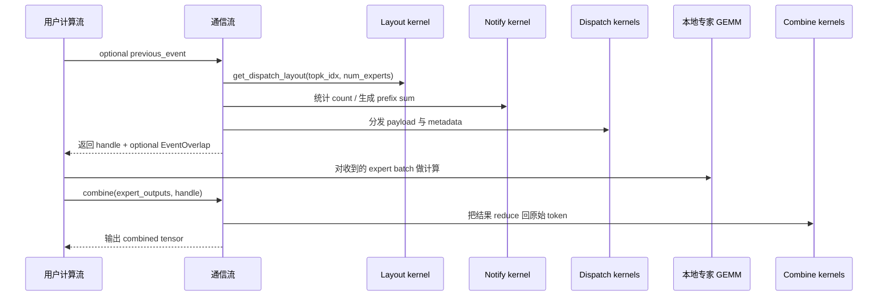
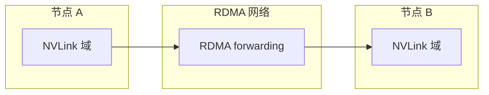

# 普通内核路径：训练与 Prefill

DeepEP 把偏吞吐导向的通信路径称为 **普通内核（normal kernels）**。它是下面这些场景的首选：

- 训练；
- 仅前向的 prefilling；
- 一切“总体带宽比单次延迟更重要”的工作负载。

## 1. 一眼看懂主流程

`get_dispatch_layout(...)`、`dispatch(...)`、`combine(...)` 被拆成三步，不是 API 设计上的矫情，而是因为底层工作天然就分成这三段：

1. 先数清楚去哪儿；
2. 再把 payload 真正送过去；
3. 最后把结果按原语义收回来。

## 2. 为什么 layout 必须单独做

门控给的是 **expert id**，而通信真正关心的是 **rank** 和 **计数**。

所以对每个 token，DeepEP 要先回答：

- 它最终要去哪些 rank？
- 每个 rank 会收到多少 token？
- 每个 expert 会收到多少 token？

`csrc/kernels/layout.cu` 的 layout kernel 就是在做这件事，最后给出：

- `num_tokens_per_rank`
- `num_tokens_per_rdma_rank`（仅 internode）
- `num_tokens_per_expert`
- `is_token_in_rank`

### 最容易忽略的一点

`is_token_in_rank[t, r]` 是一个 **布尔值**，不是次数。

也就是说，如果一个 token 命中了两个 expert，而这两个 expert 恰好都在同一个 rank 上，那么这个 token 对这个 rank 只会发送 **一次**。

这就是 layout 阶段真正节省带宽的地方：它先把“同 rank 重复命中”折叠掉了。

## 3. 用一个极简数字例子彻底说透

假设：

- 总共有 8 个 expert；
- 总共有 4 个 rank；
- 每个 rank 持有 2 个 expert。

于是 expert 到 rank 的归属关系是：

- rank 0: experts 0, 1
- rank 1: experts 2, 3
- rank 2: experts 4, 5
- rank 3: experts 6, 7

现在门控输出是：

| Token | 选中的 expert | 目标 rank | `is_token_in_rank` |
| --- | --- | --- | --- |
| `t0` | `[1, 6]` | `[0, 3]` | `[1, 0, 0, 1]` |
| `t1` | `[0, 2]` | `[0, 1]` | `[1, 1, 0, 0]` |
| `t2` | `[3, 7]` | `[1, 3]` | `[0, 1, 0, 1]` |
| `t3` | `[4, -1]` | `[2]` | `[0, 0, 1, 0]` |

那么：

- `num_tokens_per_rank = [2, 2, 1, 2]`
- `num_tokens_per_expert` 则按具体 expert id 逐个统计。

这就是 dispatch 真正需要的“发货计划单”。

## 4. `dispatch(...)` 内部真正发生了什么

Python 层会根据当前 runtime 自动分发到两条路径：

- **intranode dispatch**：所有通信都在 NVLink 域内；
- **internode dispatch**：涉及跨节点 RDMA forwarding。

### intranode 路径

`csrc/kernels/intranode.cu` 里维护的是一套节点内队列系统，核心元素包括：

- per-rank 的共享队列；
- peer barrier；
- per-channel prefix sum；
- sender / receiver 的职责拆分。

最形象的理解方式是：**每个 channel 像一节火车车厢**。

- layout 阶段先决定每个目的地要几个座位；
- prefix sum 决定每个 sender 在车厢中的座位区间；
- sender 按区间把 token 写进去；
- receiver 再按连续区间把它们读出来。

### internode 路径

`csrc/kernels/internode.cu` 又多加了一层：

- 先在本节点 NVLink 域内归整；
- 再在匹配 GPU index 的 rank 之间走 RDMA；
- 到对端节点后再在 NVLink 域内扇出。

所以 README 才会把它描述成 **从 NVLink 域 forwarding 到 RDMA 域**。

## 5. handle 里面到底装了什么

普通内核返回的 handle，本质上是后续 combine 所需的“返程地图”。

### intranode handle

常见字段包括：

- `rank_prefix_matrix`
- `channel_prefix_matrix`
- `recv_channel_prefix_matrix`
- `recv_src_idx`
- `is_token_in_rank`
- `send_head`

可以粗暴理解成：

- **prefix matrix** 告诉 sender 写哪儿、receiver 读哪儿；
- **source index** 记录 token 原始来源；
- **send head** 维护队列推进状态。

### internode handle

internode handle 会更复杂，还会带上：

- RDMA channel prefix matrix；
- global rank prefix sum；
- source metadata；
- RDMA / NVLink send head。

原因很简单：跨节点后，系统必须记住“跨节点这一跳”和“节点内再分发这一跳”的信息。

## 6. `combine(...)` 为什么不只是 dispatch 的反向操作

从图上看像反向，但在代数意义上它是 **归并 / reduce**。

- `dispatch(...)` 是把一个 token 发到所有相关 rank；
- `combine(...)` 是把这些专家输出再收回来，并按原 token 语义做 reduce。

如果传入了 `topk_weights`，那就是带权归并；如果传入了 `bias`，则会在 reduce 之后再加 bias。

这就是为什么 README 的示例里会说：

- dispatch 的 backward 本质上是 combine；
- combine 的 backward 本质上是 dispatch。

通信图是对称的，但载荷上的代数操作不是简单拷贝。

## 7. 异步与重叠

普通路径支持两种很实用的重叠方式。

### `previous_event`

如果你想让这次通信先等某段前序计算结束，就把 `EventOverlap` 传进来。

### `async_finish=True`

让通信先在 comm stream 上飞起来，调用先返回，真正需要结果时再等待。

这在专家 GEMM 与通信重叠时非常有用。

## 8. 为什么会出现 CPU 等待

普通 dispatch 的精确路径里，当前 rank 一开始可能不知道最终会收到多少 token，所以 runtime 需要等一个来自 GPU 的“收到计数信号”。

也正因为这个 CPU wait，README 才会提醒：在一般精确路径下，它并不天然适配 CUDA graph。

### `num_worst_tokens` 是什么补救手段

如果你愿意提前按最坏情况留足接收空间，就可以传 `num_worst_tokens`（仅 intranode）。

这样做的代价交换很清晰：

- **精确计数**：省内存，但可能有 CPU wait；
- **最坏预留**：更吃内存，但更适合 graph 化流程。

## 9. 想对着源码读，重点看哪几处

- `deep_ep/buffer.py`：公共 API 与 handle 结构；
- `csrc/deep_ep.cpp`：stream 协调与参数检查；
- `csrc/kernels/layout.cu`：layout 统计；
- `csrc/kernels/intranode.cu`：本地 NVLink 队列；
- `csrc/kernels/internode.cu`：跨节点 forwarding。

## 10. 下一页建议

如果你看完还是觉得 prefix sum、计数和 buffer 公式很抽象，直接去看 [数学与直觉](math-theory.md)。那一页就是专门把这些“天书”打回人话的。
