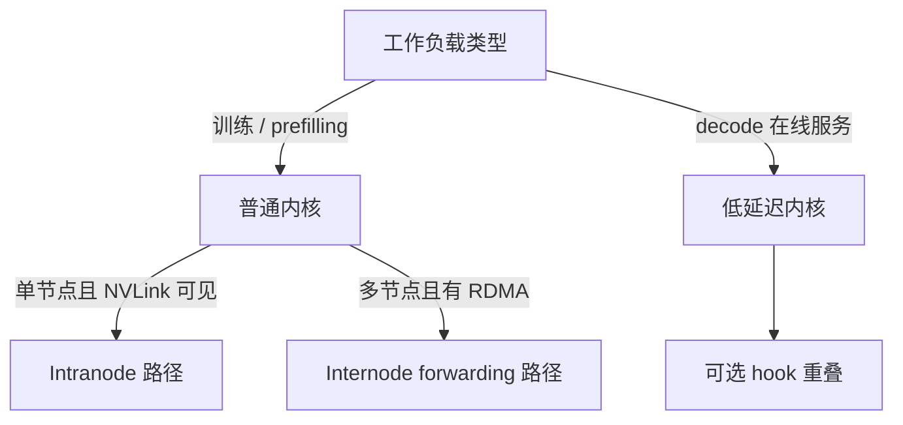

# 性能与调优

这一页讲的不是“能不能跑”，而是“怎样把 DeepEP 调到真正贴合你的拓扑与工作负载”。

## 1. 第一步永远是选对 kernel 家族

最常见的调优误区，就是拿吞吐型 kernel 去解决延迟问题，或者反过来。

## 2. 先接受它的硬拓扑假设

DeepEP 之所以快，很大程度上是因为它做了强假设。

| 假设 | 重要原因 |
| --- | --- |
| `NUM_MAX_NVL_PEERS = 8` | 代码整体围绕 8 卡 NVLink 域展开 |
| 节点内 GPU 之间 NVLink 可见 | 普通 intranode kernel 的前提 |
| 节点间有 RDMA | 普通 internode 与 low-latency 的前提 |
| 装了 NVSHMEM | 所有 RDMA 能力的基础 |
| 普通内核 `num_sms` 必须是偶数 | 因为 `num_channels = num_sms / 2` |
| low-latency 下 `num_qps_per_rank` 最好等于本地 expert 数 | decode 路径最优配置 |

## 3. 真正影响性能的公开调参项

### 运行时参数

| 参数 | 暴露位置 | 作用 |
| --- | --- | --- |
| `Buffer.set_num_sms(...)` | Python API | 控制普通内核可占用多少 SM |
| `Buffer.get_dispatch_config(...)` | Python API | 普通 dispatch 推荐 chunk 配置 |
| `Buffer.get_combine_config(...)` | Python API | 普通 combine 推荐 chunk 配置 |
| `num_qps_per_rank` | `Buffer(...)` 构造参数 | 控制 low-latency 模式下 RDMA 并行度 |
| `allow_nvlink_for_low_latency_mode` | `Buffer(...)` 构造参数 | 是否允许 low-latency 使用 NVLink 辅助 |
| `enable_shrink` | `Buffer(...)` 构造参数 | 启用动态 masking / shrink 模式 |

### 构建与部署参数

| 参数 | 作用 |
| --- | --- |
| `NVSHMEM_DIR` | 打开 NVSHMEM 相关能力 |
| `TORCH_CUDA_ARCH_LIST` | 指定目标 GPU 架构 |
| `DISABLE_SM90_FEATURES` | 禁用 Hopper 特性 |
| `DISABLE_AGGRESSIVE_PTX_INSTRS` | 在兼容性优先时禁用激进 PTX 技巧 |
| `NVSHMEM_IB_SL` | 选择 InfiniBand 虚拟 lane |

## 4. 仓库里的测试本身就是调优框架

别把 `tests/` 只当成 correctness check。它们本身就是调优 harness。

- `tests/test_intranode.py` 会扫 SM 数与 NVLink chunk size；
- `tests/test_internode.py` 会联合扫 NVLink / RDMA chunk size；
- `tests/test_low_latency.py` 会测 dispatch / combine 的时延与 hook 拆分；
- `tests/utils.py` 里有 `bench(...)` 与 `bench_kineto(...)` 工具。

因此最靠谱的调优顺序是：

1. 先把拓扑与构建配对正确；
2. 运行对应路径的测试脚本；
3. 把集群上测出来的最佳 chunk 配置记录下来；
4. 再把这些 config 写回你的框架集成层。

## 5. README 里给出的网络建议非常实战

### 流量隔离

建议把：

- 普通内核流量；
- 低延迟流量；
- 其他业务流量

分到不同的 InfiniBand virtual lane 上。

DeepEP 侧对应的环境变量是 `NVSHMEM_IB_SL`。

### 自适应路由

README 的建议很朴素：

- 网络负载重时开 adaptive routing；
- 网络负载轻时走 static routing。

原因很简单：

- adaptive routing 更抗拥塞；
- static routing 往往更低附加时延。

### 拥塞控制

仓库 README 里提到作者们在生产环境里没有明显观察到收益，所以默认不开 congestion control。

## 6. 把这些调参项翻译成物理意义

很多人调参时容易陷入“API 名字看不懂”的状态。其实把它翻译成硬件语言就好了：

- `num_sms`：你愿意拿多少计算核心去做通信；
- chunk size：每个 channel 一次搬多大一块数据；
- `num_qps_per_rank`：每个 rank 在 NIC 上开多少扇并行通道；
- `num_max_dispatch_tokens_per_rank`：decode 峰值时 buffer 必须兜住的最大 token 数。

一旦这样理解，参数就不再是抽象数字，而是清楚的资源分配策略。

## 7. 常见症状与高概率原因

| 现象 | 常见原因 |
| --- | --- |
| intranode 路径报错或表现异常 | 本地 GPU 之间并非全量 NVLink 可见 |
| low-latency 能跑但显存 / buffer 特别大 | `num_max_dispatch_tokens_per_rank` 设得太保守 |
| hook 重叠收益不明显 | 你的计算阶段与 hook 拆分点不匹配，或 NVLink 辅助与重叠假设冲突 |
| internode 吞吐上不去 | RDMA chunk size、service level、路由策略没有贴合集群 |
| 某些平台上结果异常 | 先关掉 aggressive PTX，再测兼容性 |

## 8. 一定要认真看待“Undefined PTX”那段说明

DeepEP README 明说了：项目为了极限性能，用过比较激进的 PTX 读写技巧，比如非一致缓存相关的 load 形式。

这带来的现实结论是：

- 某些平台上速度会非常好；
- 但跨平台兼容性压力会变大；
- 如果你怀疑平台不稳，就优先把 `DISABLE_AGGRESSIVE_PTX_INSTRS=1` 打开。

这是典型 HPC 风格的取舍：速度和可移植性，很多时候不能两全。

## 9. 一套务实的调优顺序

如果你在一套新集群上调 DeepEP，建议按下面顺序来：

1. 先确认 GPU 架构与编译 flag；
2. 再确认本地 NVLink 拓扑；
3. 再确认全局 RDMA 与 NVSHMEM；
4. 一次只调一条路径，不要普通和低延迟一起乱调；
5. 优先扫 chunk size，而不是急着改代码；
6. 等通信路径健康后，再考虑和专家 GEMM 的重叠细节。

这个顺序能帮你避免大量无效 debug。

## 10. 最后一句压轴经验

DeepEP 的性能，本质上来自“让软件路径服从物理拓扑”。

如果只记住一句话，那就是：

> **把 NVLink、RDMA、SM 预算当成三种不同资源，然后让 DeepEP 在最擅长的地方消耗它们。**
