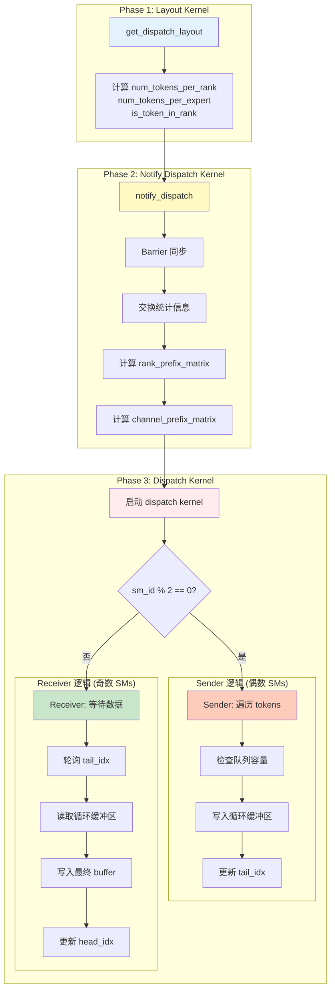
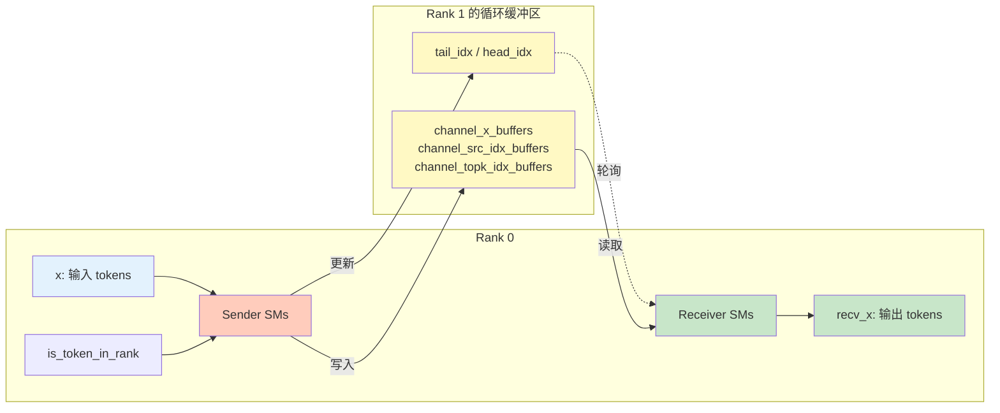

# Send/Recv 与 DeepEP 流程的关系

## 快速回答

**Send 和 Recv 是 Dispatch 阶段的核心操作**，它们在**同一个 kernel** 中并行执行。

```
完整流程：
├─ Phase 1: Layout         ← 计算路由信息
├─ Phase 2: Notify         ← 同步统计，计算前缀和
└─ Phase 3: Dispatch       ← ⭐ Send/Recv 在这里！
    ├─ Sender SMs (偶数)   ← 发送数据
    └─ Receiver SMs (奇数) ← 接收数据
```

---

## 详细流程图



---

## 代码层面的对应关系

### Phase 1: Layout

**文件**: `csrc/kernels/layout.cu`

```cpp
void get_dispatch_layout(const topk_idx_t* topk_idx,
                         int* num_tokens_per_rank,
                         int* num_tokens_per_rdma_rank,
                         int* num_tokens_per_expert,
                         bool* is_token_in_rank,
                         int num_tokens,
                         int num_topk,
                         int num_ranks,
                         int num_experts,
                         cudaStream_t stream);
```

**输出**：
- `num_tokens_per_rank`: 每个 rank 需要接收的 token 数量
- `is_token_in_rank`: token-rank 路由矩阵
- `num_tokens_per_expert`: 每个 expert 的 token 数量

**作用**: 告诉后续阶段"哪些 tokens 要发送到哪些 ranks"

---

### Phase 2: Notify Dispatch

**文件**: `csrc/kernels/intranode.cu`

```cpp
void notify_dispatch(const int* num_tokens_per_rank,
                     int* moe_recv_counter_mapped,
                     int num_ranks,
                     const int* num_tokens_per_expert,
                     int* moe_recv_expert_counter_mapped,
                     int num_experts,
                     int num_tokens,
                     const bool* is_token_in_rank,
                     int* channel_prefix_matrix,
                     int* rank_prefix_matrix_copy,
                     int num_memset_int,
                     int expert_alignment,
                     void** buffer_ptrs,
                     int** barrier_signal_ptrs,
                     int rank,
                     cudaStream_t stream,
                     int num_channels);
```

**输出**：
- `rank_prefix_matrix`: 前缀和矩阵（确定数据在接收 buffer 的位置）
- `channel_prefix_matrix`: Channel 前缀和（任务分配）

**作用**:
1. 各 rank 之间同步统计信息
2. 计算前缀和，为 send/recv 准备元数据

---

### Phase 3: Dispatch（Send/Recv 在这里！）

**文件**: `csrc/kernels/intranode.cu`

```cpp
template <int kNumRanks, int kNumThreads, int kNumTMABytesPerWarp>
__global__ void __launch_bounds__(kNumThreads, 1)
dispatch(int4* recv_x,
         float* recv_x_scales,
         int* recv_src_idx,
         topk_idx_t* recv_topk_idx,
         float* recv_topk_weights,
         int* recv_channel_offset,
         int* send_head,
         const int4* x,
         const float* x_scales,
         const topk_idx_t* topk_idx,
         const float* topk_weights,
         const bool* is_token_in_rank,
         const int* channel_prefix_matrix,
         int num_tokens,
         int num_worst_tokens,
         int hidden_int4,
         int num_topk,
         int num_experts,
         int num_scales,
         int scale_token_stride,
         int scale_hidden_stride,
         void** buffer_ptrs,
         int rank,
         int num_max_send_tokens,
         int num_recv_buffer_tokens);
```

**关键逻辑**：

```cpp
// Line 223-225
const auto sm_id = static_cast<int>(blockIdx.x);
const auto thread_id = static_cast<int>(threadIdx.x);
const bool is_sender = sm_id % 2 == 0;  // ⭐ 这里决定角色！

// Line 295-398: Sender 逻辑
if (is_sender) {
    // Workers for sending
    constexpr int num_send_warps = kNumThreads / 32;
    constexpr int num_send_warps_per_rank = num_send_warps / kNumRanks;

    // 初始化 channel 元数据
    st_relaxed_sys_global(channel_start_offset.buffer(), -value - 1);
    st_relaxed_sys_global(channel_end_offset.buffer(), -value - 1);

    // 遍历 tokens 并发送
    for (int64_t token_idx = token_start_idx; token_idx < token_end_idx;) {
        // 检查队列容量
        while (num_recv_buffer_tokens - num_used_slots < num_max_send_tokens);

        // 拷贝数据到循环缓冲区
        UNROLLED_WARP_COPY(...);

        // 更新 tail_idx
        st_release_sys_global(channel_tail_idx.buffer(), cached_channel_tail_idx);
    }
}

// Line 399-532: Receiver 逻辑
else {
    // Workers for receiving and copying into buffer
    constexpr int num_recv_warps = kNumThreads / 32;
    constexpr int num_recv_warps_per_rank = num_recv_warps / kNumRanks;

    // 等待 channel 元数据
    while ((total_offset = ld_volatile_global(channel_start_offset.buffer())) == 0);
    while ((num_tokens_to_recv = ld_volatile_global(channel_end_offset.buffer())) == 0);

    // 循环接收数据
    while (num_tokens_to_recv > 0) {
        // 轮询 tail_idx
        cached_channel_tail_idx = ld_acquire_sys_global(channel_tail_idx.buffer());

        // 从循环缓冲区读取数据
        UNROLLED_WARP_COPY(...);

        // 更新 head_idx
        st_relaxed_sys_global(channel_head_idx.buffer(), cached_channel_head_idx);
    }
}
```

**作用**:
- **Sender**: 将本地 tokens 发送到其他 ranks 的循环缓冲区
- **Receiver**: 从循环缓冲区读取数据，写入最终接收 buffer

---

## 三个阶段的数据依赖关系

```
Layout 阶段输出：
├─ num_tokens_per_rank[8]      = [120, 95, 110, 88, ...]
├─ is_token_in_rank[4096, 8]   = [[T,F,T,F,...], ...]
└─ num_tokens_per_expert[64]   = [45, 52, 38, ...]

         ↓ 传递给 Notify

Notify 阶段输出：
├─ rank_prefix_matrix[8, 8]:
│    [120, 95,  110, 88, ...]   ← Rank 0 的贡献
│    [240, 185, 225, 180, ...]  ← Rank 0+1 的累计
│    [...                  ]
│
└─ channel_prefix_matrix[8, 12]:
     每个 channel 负责的 tokens 累计数量

         ↓ 传递给 Dispatch

Dispatch 阶段执行：
├─ Sender: 使用 is_token_in_rank, channel_prefix_matrix
│    ├─ 判断哪些 tokens 要发送
│    ├─ 发送到对应 rank 的循环缓冲区
│    └─ 更新 tail_idx
│
└─ Receiver: 使用 rank_prefix_matrix
     ├─ 确定接收数据在最终 buffer 的位置
     ├─ 从循环缓冲区读取
     └─ 写入 recv_x, recv_topk_idx, recv_src_idx
```

---

## Python API 层面的调用流程

```python
from deep_ep import Buffer

# 1. 初始化 buffer
buffer = Buffer(group, num_nvl_bytes, num_rdma_bytes)

# 2. Layout 阶段（第一个 kernel）
num_tokens_per_rank, _, num_tokens_per_expert, is_token_in_rank, _ = \
    buffer.get_dispatch_layout(topk_idx, num_experts)
    # ↑ 调用 layout.cu: get_dispatch_layout

# 3. Dispatch 阶段（内部包含 Notify + Send/Recv）
recv_x, recv_topk_idx, recv_topk_weights, num_recv_tokens_per_expert_list, handle, _ = \
    buffer.dispatch(
        x=x,
        topk_idx=topk_idx,
        topk_weights=topk_weights,
        num_tokens_per_rank=num_tokens_per_rank,
        is_token_in_rank=is_token_in_rank,
        num_tokens_per_expert=num_tokens_per_expert
    )
    # ↑ 内部调用：
    #   1. notify_dispatch (intranode.cu)  ← Notify 阶段
    #   2. dispatch (intranode.cu)         ← Send/Recv 阶段
```

---

## C++ 层面的调用栈

```cpp
// Python 调用 buffer.dispatch()
buffer.py: dispatch() [Line 322]
    ↓
// 进入 C++ binding
deep_ep.cpp: intranode_dispatch() [Line 387]
    ↓
// 调用 notify_dispatch kernel
intranode.cu: notify_dispatch() [Line 115]
    └─ kernel: notify_dispatch<kNumRanks><<<...>>>() [Line 12]

    ↓
// 调用 dispatch kernel (⭐ Send/Recv 在这里！)
intranode.cu: dispatch() [Line 534]
    └─ kernel: dispatch<kNumRanks, kNumThreads, kNumTMABytesPerWarp><<<...>>>() [Line 198]
        ├─ if (is_sender): Sender 逻辑 [Line 295-398]
        └─ else: Receiver 逻辑 [Line 399-532]
```

---

## 时间轴视图

```
时间轴 ────────────────────────────────────────────────►

T0: Layout Kernel 启动
    ├─ 计算 num_tokens_per_rank
    ├─ 计算 is_token_in_rank
    └─ 计算 num_tokens_per_expert
    [耗时: ~50 μs]

T1: Notify Dispatch Kernel 启动
    ├─ Barrier 同步
    ├─ 交换统计信息
    ├─ 计算 rank_prefix_matrix
    └─ 计算 channel_prefix_matrix
    [耗时: ~100 μs]

T2: Dispatch Kernel 启动（⭐ Send/Recv 并行执行）
    ┌──────────────────────────────────────┐
    │ Sender SMs (0,2,4,...)               │
    │   ├─ 写入 channel_start/end_offset   │
    │   ├─ 遍历 tokens                     │
    │   ├─ 检查队列容量                    │
    │   ├─ 拷贝数据到循环缓冲区            │
    │   └─ 更新 tail_idx                   │
    │                                      │
    │ Receiver SMs (1,3,5,...)             │
    │   ├─ 等待 channel 元数据             │
    │   ├─ 轮询 tail_idx                   │
    │   ├─ 从循环缓冲区读取                │
    │   ├─ 写入最终 buffer                 │
    │   └─ 更新 head_idx                   │
    └──────────────────────────────────────┘
    [耗时: ~500 μs - 几 ms，取决于数据量]

T3: 完成
    ├─ recv_x 包含接收的 tokens
    ├─ recv_topk_idx, recv_topk_weights 包含路由信息
    └─ recv_src_idx 包含原始索引
```

---

## Send/Recv 的数据流



---

## 关键要点总结

### 1. Send/Recv 在 Dispatch Kernel 中

```cpp
// dispatch kernel 是一个 kernel，包含 send 和 recv 两种逻辑
__global__ void dispatch(...) {
    if (is_sender) {
        // Sender 逻辑
    } else {
        // Receiver 逻辑
    }
}

// 启动时，所有 SMs 都运行这个 kernel
// 但根据 sm_id 的奇偶性，执行不同的分支
```

### 2. Send/Recv 依赖前置阶段的输出

```
Layout 输出 → Notify 使用 → Dispatch (Send/Recv) 使用

具体依赖：
├─ Send 依赖：is_token_in_rank (来自 Layout)
│            channel_prefix_matrix (来自 Notify)
│
└─ Recv 依赖：rank_prefix_matrix (来自 Notify)
             channel_start/end_offset (来自 Send)
```

### 3. Send/Recv 是同一个 Kernel 的两个分支

```
不是两个独立的 kernel！
不是先运行 Send kernel，再运行 Recv kernel！

而是：
  启动一个 dispatch kernel
  ├─ 偶数 SMs 执行 Send 分支（并行）
  └─ 奇数 SMs 执行 Recv 分支（并行）
```

### 4. Send/Recv 通过循环缓冲区通信

```
Sender → 循环缓冲区 → Receiver
  ↑         ↑↓          ↑
  写数据   tail/head   读数据
         (同步指针)
```

---

## 完整流程示意图

```
┌──────────────────────────────────────────────────────┐
│                  DeepEP Dispatch 流程                 │
├──────────────────────────────────────────────────────┤
│                                                      │
│  1. Layout Kernel                                    │
│     ├─ 输入: topk_idx                                │
│     └─ 输出: num_tokens_per_rank, is_token_in_rank   │
│                                                      │
│              ↓                                       │
│                                                      │
│  2. Notify Dispatch Kernel                           │
│     ├─ 输入: num_tokens_per_rank                     │
│     ├─ 处理: Barrier, 交换统计, 计算前缀和           │
│     └─ 输出: rank_prefix_matrix, channel_prefix_matrix│
│                                                      │
│              ↓                                       │
│                                                      │
│  3. Dispatch Kernel (⭐ Send/Recv 在这里)            │
│     ├─ 输入: x, is_token_in_rank, rank_prefix_matrix │
│     │                                                │
│     ├─ 分支 A: Sender (偶数 SMs)                     │
│     │   ├─ 检查 is_token_in_rank[token][rank]        │
│     │   ├─ 写入循环缓冲区                            │
│     │   └─ 更新 tail_idx                             │
│     │                                                │
│     ├─ 分支 B: Receiver (奇数 SMs)                   │
│     │   ├─ 轮询 tail_idx                             │
│     │   ├─ 读取循环缓冲区                            │
│     │   └─ 写入 recv_x, recv_topk_idx               │
│     │                                                │
│     └─ 输出: recv_x, recv_topk_idx, recv_topk_weights│
│                                                      │
└──────────────────────────────────────────────────────┘
```

---

## 对比：其他可能的设计

### ❌ 错误理解 1：Send 和 Recv 是两个 Kernel

```cpp
// 错误的假设
__global__ void send_kernel(...);  // 所有 SMs 发送
__global__ void recv_kernel(...);  // 所有 SMs 接收

// 顺序调用
send_kernel<<<...>>>();
cudaDeviceSynchronize();  // 等待所有发送完成
recv_kernel<<<...>>>();   // 然后接收

// 问题：需要全局同步，性能差
```

### ✅ 实际设计：Send 和 Recv 是同一个 Kernel 的分支

```cpp
// 实际的设计
__global__ void dispatch(...) {
    if (sm_id % 2 == 0) {
        // Send 逻辑
    } else {
        // Recv 逻辑
    }
}

// 一次启动，并行执行
dispatch<<<num_sms, kNumThreads>>>();

// 优势：无需全局同步，流水线并行
```

---

## 总结

### Send/Recv 跟哪个流程结合？

**答案**：Send/Recv 是 **Dispatch Kernel** 的核心操作，它们：

1. **在同一个 kernel 中**并行执行
2. **依赖 Layout 和 Notify** 阶段的输出
3. **通过循环缓冲区**协调工作
4. **使用不同的 SMs**（偶数 vs 奇数）执行不同角色

### 三阶段关系

```
Layout (Kernel 1)
  ↓ 输出路由信息
Notify (Kernel 2)
  ↓ 输出前缀和
Dispatch (Kernel 3) ← ⭐ Send/Recv 都在这里！
  ├─ Send (偶数 SMs)
  └─ Recv (奇数 SMs)
```

### 关键设计

Send 和 Recv **不是独立的流程**，而是 **Dispatch 流程的两个并行分支**！

这种设计实现了：
- ✅ 全双工通信
- ✅ 无死锁
- ✅ 流水线并行
- ✅ 高资源利用率

这就是 DeepEP 的精妙设计！🚀
