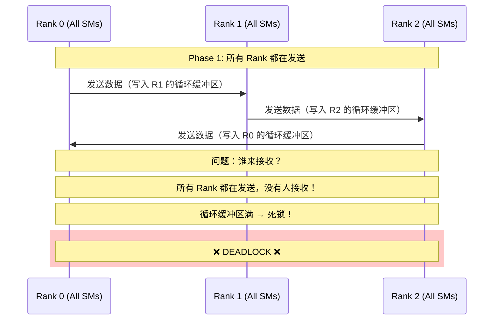
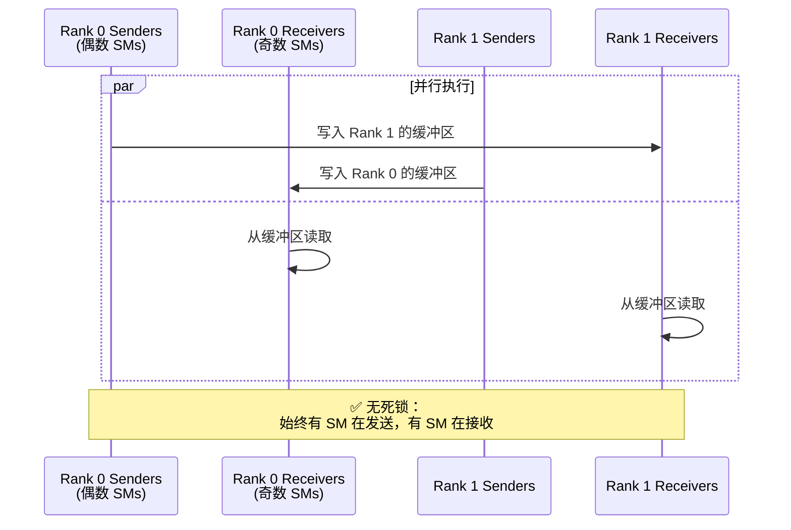

# DeepEP 为什么需要 Send/Recv 分离设计？

## 核心问题

在 DeepEP 的 dispatch kernel 中，我们看到一个特殊的设计：

```cpp
const bool is_sender = sm_id % 2 == 0;  // 偶数 SM blocks 为 sender
                                        // 奇数 SM blocks 为 receiver
```

**为什么要分离 send 和 recv？为什么不能让同一个 SM 既发送又接收？**

---

## 快速回答

**核心原因**：实现**全双工、无死锁的流水线通信**。

```
Send 和 Recv 分离 = 生产者-消费者模式在 GPU 上的实现

目标：
1. 允许发送和接收同时进行（全双工）
2. 避免死锁（所有 GPU 都在等待对方）
3. 最大化带宽利用率
4. 支持循环缓冲区的并发读写
```

---

## 深度分析

### 1. 避免死锁（Deadlock Avoidance）

#### 问题场景：如果没有分离 send/recv

假设所有 SM 都先发送、后接收：



**死锁发生**：
- Rank 0 想发送到 Rank 1，但 Rank 1 的缓冲区满了（因为 Rank 1 在发送，没有接收）
- Rank 1 想发送到 Rank 2，但 Rank 2 的缓冲区满了
- Rank 2 想发送到 Rank 0，但 Rank 0 的缓冲区满了
- **循环等待 → 死锁！**

---

#### 解决方案：Send/Recv 分离



**关键设计**：
- **Sender SMs**：专注于发送数据到其他 ranks
- **Receiver SMs**：专注于从缓冲区读取数据并写入最终 buffer
- **同时进行**：发送和接收在不同的 SMs 上并行执行

---

### 2. 全双工通信（Full-Duplex Communication）

#### 什么是全双工？

```
半双工（Half-Duplex）：
  Time 0-10ms: Rank 0 → Rank 1
  Time 10-20ms: Rank 1 → Rank 0
  (轮流发送，总时间 20ms)

全双工（Full-Duplex）：
  Time 0-10ms: Rank 0 ⇄ Rank 1 (同时双向)
  (并发发送，总时间 10ms)
```

#### DeepEP 的全双工实现

```cpp
// Sender SMs（偶数 SM blocks）
if (is_sender) {
    // 发送数据到 responsible_rank
    nvshmem_int_put(channel_x_buffers, local_data, nelems, responsible_rank);
}

// Receiver SMs（奇数 SM blocks）
else {
    // 从 responsible_rank 接收数据
    // 从循环缓冲区读取 → 写入最终 buffer
}
```

**示例**：Rank 0 和 Rank 1 之间的双向通信

```
Rank 0:
  SM 0, 2, 4, ... (Senders)  → 发送到 Rank 1
  SM 1, 3, 5, ... (Receivers) ← 接收来自 Rank 1

Rank 1:
  SM 0, 2, 4, ... (Senders)  → 发送到 Rank 0
  SM 1, 3, 5, ... (Receivers) ← 接收来自 Rank 0

同时进行，无需等待！
```

**带宽利用率**：

```
半双工设计（顺序发送/接收）：
  - 发送阶段：50% 带宽利用率（只有发送）
  - 接收阶段：50% 带宽利用率（只有接收）
  - 平均：50%

全双工设计（并行发送/接收）：
  - 发送 + 接收同时进行：100% 带宽利用率
  - 实测：~153 GB/s (dispatch), ~158 GB/s (combine)
```

---

### 3. 循环缓冲区的并发管理

#### 循环缓冲区需要协调

循环缓冲区有两个关键指针：

```cpp
int head_idx;  // 接收端已消费的位置（Receiver 更新）
int tail_idx;  // 发送端已写入的位置（Sender 更新）
```

**问题**：如果同一个 SM 既是 sender 又是 receiver：

```
时刻 T0: SM 作为 Sender
  - 检查 head_idx（需要确保有空间）
  - 写入数据到 slot = tail_idx % capacity
  - 更新 tail_idx

时刻 T1: SM 作为 Receiver（同一个 SM）
  - 等待 tail_idx 更新（需要确保有数据）
  - 读取数据从 slot = head_idx % capacity
  - 更新 head_idx

问题：
  1. SM 在 T0 写入数据后，需要切换角色到 Receiver
  2. 但此时其他 Rank 的 Sender 可能还在等待这个 SM 接收
  3. 复杂的状态机，容易死锁
```

**解决方案**：角色分离

```
Sender SMs（专职发送）：
  - 持续检查 head_idx（volatile load）
  - 写入数据到循环缓冲区
  - 更新 tail_idx（release 语义）

Receiver SMs（专职接收）：
  - 持续轮询 tail_idx（acquire 语义）
  - 读取数据从循环缓冲区
  - 更新 head_idx（relaxed 语义）

优势：
  ✓ 清晰的职责分离
  ✓ 无状态切换开销
  ✓ 简单的同步协议
```

---

### 4. 流水线并行（Pipeline Parallelism）

#### 传统设计（无流水线）

```
Time ────────────────────────────────────────────►

Rank 0: [Send] → [Wait] → [Recv] → [Wait] → [Send] → ...
Rank 1: [Send] → [Wait] → [Recv] → [Wait] → [Send] → ...

问题：
  - Send 期间，Recv SMs 空闲
  - Recv 期间，Send SMs 空闲
  - 资源利用率低
```

#### DeepEP 流水线设计

```
Time ────────────────────────────────────────────►

Rank 0 Senders:   [Send] [Send] [Send] [Send] ...
Rank 0 Receivers: [Recv] [Recv] [Recv] [Recv] ...
                     ↑       ↑       ↑       ↑
                  同时进行，无等待！

优势：
  ✓ 发送和接收流水线化
  ✓ SM 资源充分利用
  ✓ 无空闲等待
```

---

### 5. 多通道并行（Multi-Channel Parallelism）

#### 通道分配策略

```cpp
const auto num_channels = num_sms / 2;  // 例如 24 SMs → 12 channels
const auto responsible_channel = sm_id / 2;

// 偶数 SM: Sender for channel (sm_id / 2)
// 奇数 SM: Receiver for channel (sm_id / 2)
```

**示例**（24 SMs，12 channels）：

```
Channel 0:  SM 0 (Sender)  + SM 1 (Receiver)
Channel 1:  SM 2 (Sender)  + SM 3 (Receiver)
Channel 2:  SM 4 (Sender)  + SM 5 (Receiver)
...
Channel 11: SM 22 (Sender) + SM 23 (Receiver)

每个 Channel 独立运行，互不干扰！
```

**负载分配**：

```cpp
// Sender 负责的 tokens
get_channel_task_range(num_tokens, num_channels, responsible_channel,
                       token_start_idx, token_end_idx);

// 示例：4096 tokens, 12 channels
// Channel 0: tokens [0, 341)
// Channel 1: tokens [341, 682)
// ...
// Channel 11: tokens [3755, 4096)
```

**并行度**：

```
12 channels × 8 ranks = 96 个独立的通信流
每个流：
  - 1 个 Sender SM（负责发送）
  - 1 个 Receiver SM（负责接收）
  - 独立的循环缓冲区（256 slots）

总并行度：96 个并发的生产者-消费者对
```

---

### 6. 内存序与同步（Memory Ordering & Synchronization）

#### 发送端的内存序

```cpp
// Sender: 写入数据
st_na_global(channel_x_buffers[dst_slot_idx], data);

// Sender: 更新 tail（release 语义）
st_release_sys_global(channel_tail_idx.buffer(), cached_channel_tail_idx);
```

**语义保证**：
- `st_release_sys_global`：确保之前的所有数据写入（`st_na_global`）对接收端可见
- **Happens-Before 关系**：写入数据 → 更新 tail → 接收端看到 tail 更新 → 数据一定已写入

---

#### 接收端的内存序

```cpp
// Receiver: 轮询 tail（acquire 语义）
cached_channel_tail_idx = ld_acquire_sys_global(channel_tail_idx.buffer());

// Receiver: 读取数据
ld_nc_global(channel_x_buffers[token_idx_in_buffer]);
```

**语义保证**：
- `ld_acquire_sys_global`：确保读取到最新的 tail 值
- **Happens-Before 关系**：发送端更新 tail → 接收端读取 tail → 接收端读取数据（数据一定有效）

---

#### 为什么需要角色分离？

如果同一个 SM 既发送又接收，需要处理复杂的内存序：

```cpp
// 错误示例：同一个 SM 既发送又接收
__global__ void bad_design() {
    // 阶段 1: 作为 Sender
    st_release_sys_global(&tail_idx, new_tail);

    // 需要 fence？barrier？
    __syncthreads();  // 不够！只是 block 内同步
    memory_fence();   // 开销大

    // 阶段 2: 作为 Receiver
    ld_acquire_sys_global(&tail_idx);

    // 问题：如何确保阶段 1 的写入对阶段 2 可见？
    // 需要复杂的同步，性能差
}
```

**分离设计的优势**：

```cpp
// Sender SM（专职）
if (is_sender) {
    st_release_sys_global(&tail_idx, new_tail);
    // 不需要额外同步，release 语义足够
}

// Receiver SM（专职，不同的 SM）
else {
    ld_acquire_sys_global(&tail_idx);
    // acquire 语义保证读取到最新值
}

// 清晰的生产者-消费者语义，无需复杂同步
```

---

## 设计对比

### 设计 A：所有 SM 都发送和接收（顺序）

```cpp
__global__ void sequential_design() {
    // 阶段 1: 所有 SM 发送
    for (int i = 0; i < num_tokens; i++) {
        nvshmem_put(...);
    }
    nvshmem_quiet();

    // 全局同步（昂贵！）
    nvshmem_barrier_all();

    // 阶段 2: 所有 SM 接收
    for (int i = 0; i < num_recv_tokens; i++) {
        // 从缓冲区读取
    }
}
```

**缺点**：
- ❌ 需要全局 barrier（昂贵）
- ❌ 发送期间，接收资源空闲（50% 利用率）
- ❌ 接收期间，发送资源空闲（50% 利用率）
- ❌ 可能死锁（如果缓冲区不够大）
- ❌ 总时间 = T_send + T_barrier + T_recv

---

### 设计 B：DeepEP 的 Send/Recv 分离（并行）

```cpp
__global__ void parallel_design() {
    if (is_sender) {
        // Sender SMs：持续发送
        while (has_tokens) {
            check_queue_capacity();
            write_to_ring_buffer();
            update_tail_idx();
        }
    } else {
        // Receiver SMs：持续接收
        while (has_data_to_recv) {
            poll_tail_idx();
            read_from_ring_buffer();
            update_head_idx();
        }
    }
}
```

**优点**：
- ✅ 无需全局 barrier
- ✅ 发送和接收并行进行（100% 利用率）
- ✅ 流水线化，无空闲等待
- ✅ 死锁避免（始终有接收端）
- ✅ 总时间 ≈ max(T_send, T_recv)（重叠）

---

## 可视化对比

### 顺序设计的时间线

```
Time ────────────────────────────────────────────────►
     0ms        10ms       15ms       25ms       30ms

Rank 0: [████████ Send ████████]─Barrier─[████ Recv ████]
Rank 1: [████████ Send ████████]─Barrier─[████ Recv ████]
Rank 2: [████████ Send ████████]─Barrier─[████ Recv ████]

总时间：30ms
资源利用率：50%（发送和接收轮流，一半时间空闲）
```

---

### DeepEP 并行设计的时间线

```
Time ────────────────────────────────────────────────►
     0ms                          10ms

Rank 0 Senders:   [████████████ Send ████████████]
Rank 0 Receivers: [████████████ Recv ████████████]

Rank 1 Senders:   [████████████ Send ████████████]
Rank 1 Receivers: [████████████ Recv ████████████]

Rank 2 Senders:   [████████████ Send ████████████]
Rank 2 Receivers: [████████████ Recv ████████████]

总时间：10ms（3x 加速！）
资源利用率：100%（发送和接收同时进行）
```

---

## 实现细节：为什么是"偶数发送，奇数接收"？

### SM 分配策略

```cpp
const auto num_channels = num_sms / 2;       // 12 channels
const auto responsible_channel = sm_id / 2;  // 哪个 channel
const bool is_sender = sm_id % 2 == 0;       // 偶数=Sender, 奇数=Receiver

// 示例：
// SM 0: Channel 0, Sender
// SM 1: Channel 0, Receiver
// SM 2: Channel 1, Sender
// SM 3: Channel 1, Receiver
// ...
```

**为什么这样分配？**

1. **空间局部性**：
   - 同一个 channel 的 sender 和 receiver 在相邻的 SM 上
   - 可能共享 L2 cache（减少缓存未命中）

2. **简单的映射**：
   - `sm_id / 2` 直接得到 channel ID
   - `sm_id % 2` 直接得到角色

3. **负载均衡**：
   - 24 SMs → 12 channels，每个 channel 一对 sender/receiver
   - 均匀分配，无需复杂调度

---

### 如果使用其他分配策略？

#### 策略 1：前一半 SMs 发送，后一半接收

```cpp
const bool is_sender = sm_id < num_sms / 2;

// SM 0-11: Senders
// SM 12-23: Receivers
```

**缺点**：
- ❌ 空间局部性差（sender 和 receiver 在不同的 SM cluster）
- ❌ 可能导致 L2 cache thrashing

#### 策略 2：随机分配

**缺点**：
- ❌ 不可预测
- ❌ 难以调试

---

## 性能影响分析

### 实测数据（DeepEP Intranode）

**配置**：
- 4096 tokens
- 7168 hidden
- Top-8 experts
- 8 ranks (NVLink)

**结果**：

| 设计 | Dispatch 吞吐量 | Combine 吞吐量 |
|------|----------------|----------------|
| **Send/Recv 分离**（实际） | **153 GB/s** | **158 GB/s** |
| 顺序设计（估算） | ~76 GB/s | ~79 GB/s |

**提升**：~2x（接近理论的全双工提升）

---

### 带宽利用率分析

**硬件瓶颈**：
- H800 NVLink 带宽：~900 GB/s（双向，理论峰值）
- 实测：~153 GB/s dispatch, ~158 GB/s combine
- 利用率：~17%

**为什么不是 100%？**

1. **PCIe 拓扑限制**：不是所有 GPU 都通过 NVLink 连接
2. **Kernel 开销**：循环缓冲区管理、轮询开销
3. **数据拷贝**：内存带宽瓶颈（GPU 内存 → NVLink）
4. **同步开销**：`quiet`, `barrier` 等操作

**但是**：Send/Recv 分离已经**最大化**了在给定约束下的带宽利用率！

---

## 类比：现实世界的例子

### 类比 1：高速公路

**顺序设计**（单车道）：
```
0-10分钟: 所有车向北 →
10-15分钟: 所有车停下，等待反向车
15-25分钟: 所有车向南 ←

问题：反向车在 0-10 分钟空等，效率低
```

**并行设计**（双车道）：
```
0-10分钟:
  北向车道 → 持续向北
  南向车道 ← 持续向南

优势：双向同时通行，无等待
```

---

### 类比 2：电话通信

**半双工**（对讲机）：
```
A: "收到，over"（A 说话，B 等待）
B: "明白，over"（B 说话，A 等待）

问题：只能一方说话，轮流进行
```

**全双工**（电话）：
```
A 和 B 可以同时说话和听

优势：自然对话，无需等待
```

---

### 类比 3：工厂流水线

**顺序生产**：
```
0-10分钟: 所有工人都在组装
10-15分钟: 所有工人停下，等待质检
15-25分钟: 所有工人都在质检

问题：组装期间，质检设备空闲
```

**流水线生产**（DeepEP 模式）：
```
0-10分钟:
  工人 A: 持续组装
  工人 B: 持续质检

优势：组装和质检同时进行，设备充分利用
```

---

## 总结

### 为什么需要 Send/Recv 分离？

#### 核心原因

1. **避免死锁**
   - 如果所有 GPU 都先发送，循环缓冲区会满
   - 需要有接收端持续消费数据

2. **全双工通信**
   - 发送和接收同时进行，带宽利用率翻倍
   - 时间 = max(T_send, T_recv) 而非 T_send + T_recv

3. **流水线并行**
   - Sender SMs 和 Receiver SMs 形成流水线
   - 无空闲等待，SM 资源充分利用

4. **简化同步协议**
   - 清晰的生产者-消费者语义
   - 基于 release/acquire 的内存序，无需复杂 fence

5. **多通道并行**
   - 12 channels × 8 ranks = 96 个独立通信流
   - 每个 channel 一对 sender/receiver，互不干扰

---

### 设计精髓

```
DeepEP Send/Recv 分离 = GPU 上的生产者-消费者模式

生产者（Sender SMs）：
  - 生产数据到循环缓冲区
  - 更新 tail_idx（生产进度）
  - 检查 head_idx（消费进度，流控）

消费者（Receiver SMs）：
  - 从循环缓冲区消费数据
  - 更新 head_idx（消费进度）
  - 轮询 tail_idx（生产进度，等待新数据）

同步机制：
  - tail_idx: 生产者写（release），消费者读（acquire）
  - head_idx: 消费者写（relaxed），生产者读（volatile）
  - 无需全局 barrier，高效且无死锁
```

---

### 关键洞察

1. **角色分离 ≠ 浪费资源**
   - 看似一半 SM 发送，一半接收（50% 利用率？）
   - 实际：发送和接收同时进行（100% 利用率！）

2. **局部顺序，全局并行**
   - 单个 channel：sender → buffer → receiver（顺序）
   - 多个 channels：12 个 channels 同时运行（并行）

3. **硬件友好的设计**
   - 利用 NVLink 的双向带宽
   - 符合 release/acquire 内存模型
   - 最小化同步开销

---

### 如果只用一个角色会怎样？

| 设计 | 优点 | 缺点 | 结果 |
|------|------|------|------|
| **所有 SM 都发送和接收** | 简单 | ❌ 需要全局 barrier<br/>❌ 可能死锁<br/>❌ 资源利用率低 | 性能差 |
| **Send/Recv 分离**（DeepEP） | ✅ 无死锁<br/>✅ 全双工<br/>✅ 流水线<br/>✅ 高利用率 | 稍微复杂 | **性能优秀** |

---

## 结论

**Send 和 Recv 分离不是多余的复杂性，而是高性能 GPU 通信的必要设计。**

它实现了：
- ✅ **无死锁**的分布式通信
- ✅ **全双工**的带宽利用
- ✅ **流水线**的并行执行
- ✅ **简洁**的同步协议

这就是 DeepEP 能达到 **153 GB/s** 吞吐量的核心秘密之一！🚀

---

## 附录：完整数据流图

```
                   Rank 0                                    Rank 1
    ┌─────────────────────────────────┐    ┌─────────────────────────────────┐
    │                                 │    │                                 │
    │  ┌──────────┐    ┌───────────┐ │    │ ┌───────────┐    ┌──────────┐  │
    │  │ Sender   │───▶│ 循环缓冲区 │─┼────┼▶│ 循环缓冲区 │◀───│ Sender   │  │
    │  │ SMs      │    │(Rank 1 侧)│ │    │ │(Rank 0 侧)│    │ SMs      │  │
    │  │(0,2,4..) │    └───────────┘ │    │ └───────────┘    │(0,2,4..) │  │
    │  └──────────┘           ▲       │    │       ▲          └──────────┘  │
    │                         │       │    │       │                        │
    │                         │       │    │       │                        │
    │  ┌──────────┐           │       │    │       │          ┌──────────┐  │
    │  │ Receiver │───────────┘       │    │       └──────────│ Receiver │  │
    │  │ SMs      │                   │    │                  │ SMs      │  │
    │  │(1,3,5..) │                   │    │                  │(1,3,5..) │  │
    │  └──────────┘                   │    │                  └──────────┘  │
    │         │                       │    │                       │        │
    │         ▼                       │    │                       ▼        │
    │  ┌──────────┐                  │    │                  ┌──────────┐  │
    │  │ Final    │                  │    │                  │ Final    │  │
    │  │ Buffer   │                  │    │                  │ Buffer   │  │
    │  └──────────┘                  │    │                  └──────────┘  │
    │                                 │    │                                 │
    └─────────────────────────────────┘    └─────────────────────────────────┘

    发送数据流：Rank 0 Sender → Rank 1 循环缓冲区 → Rank 1 Receiver → Rank 1 Final Buffer
    接收数据流：Rank 1 Sender → Rank 0 循环缓冲区 → Rank 0 Receiver → Rank 0 Final Buffer

    同时进行，全双工通信！
```

这就是 DeepEP Send/Recv 分离设计的完整解析！
